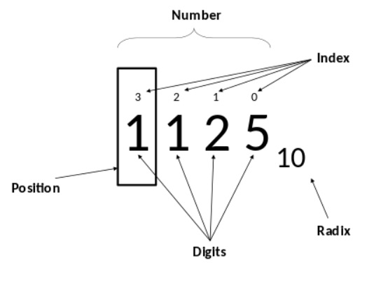
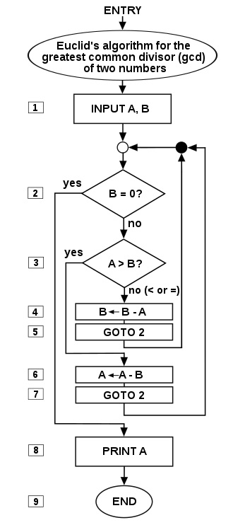
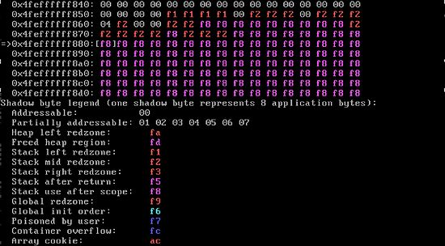

# 我的第二次作业
## Part 1：进制转换
#### ① 1分12秒 = （7.2*104）毫秒； ② (7A)13 = (101)10； ③ (7A)16 = (122)10； ④ (7A)16 = (1111010)2 = (172)8； ⑤ (1011011)2 = (133)8 = (5B)16； ⑥ (678)10 = (1010100110)2 = (1246)8； ⑦ (111)2 + (101)2 = (1100)2. 
## Part 2：*Search the keyword*
Word|Explanation
---|--|---
**Information**|**Information** is any entity or form that **provides** the answer **to** a question of some kind or resolves uncertainty.
**Positional notation**|**Positional notation** or *place-value notation* is a method of **representing** or **encoding** numbers.
**Algorithm**|In mathematics and computer science, an **algorithm** is an unambiguous specification of how to solveclass of problems.
**Software bug**|A **software bug** is an **error**, flaw, failure or fault in a computer program or system that causes it to produce an **incorrect** or **unexpected** result, or to behave in **unintended** ways.
## Part 3：中文英译
Chinese|English|Explanation
---|--|---
**十进制**|**Decimal**|The **decimal numeral** system (also called **base-ten positional numeral system**, and occasionally called **denary**) is the standard system for denoting integer and non-integer numbers.
**二进制**|**Binary**|在数学和数字电路中，二进制（binary）数是指用二进制记数系统，即以2为基数的记数系统表示的数字。
**八进制**|**Octonary**|An **octonary** is an eight-line section in a poem, song or psalm.
**十六进制**|**Hexadecimal**|In mathematics and computing, **hexadecimal** (also **base 16**, or **hex**) is a positional numeral system with a radix, or base, of 16.