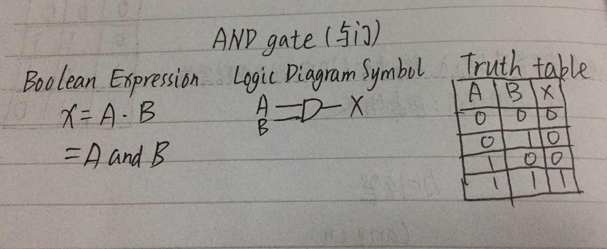
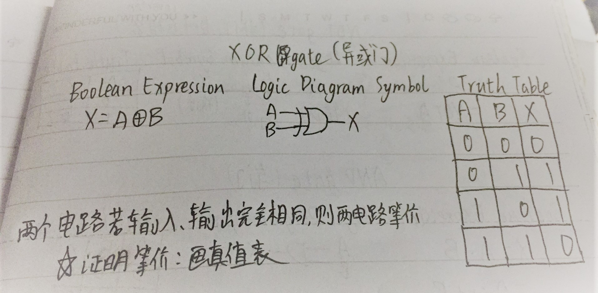
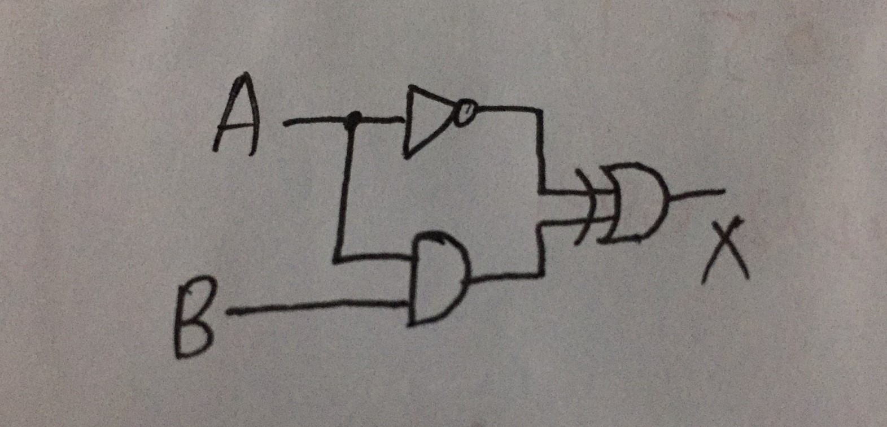
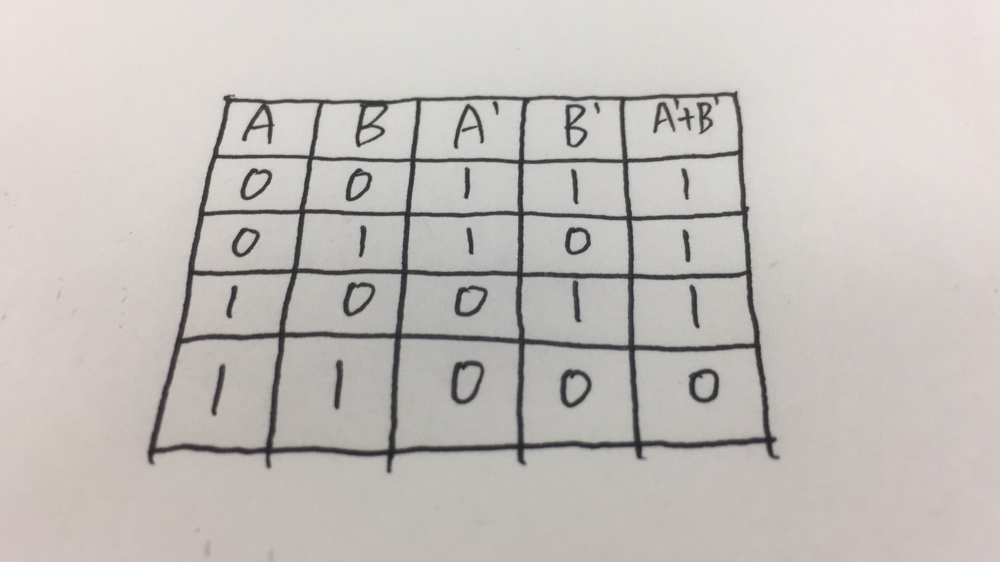
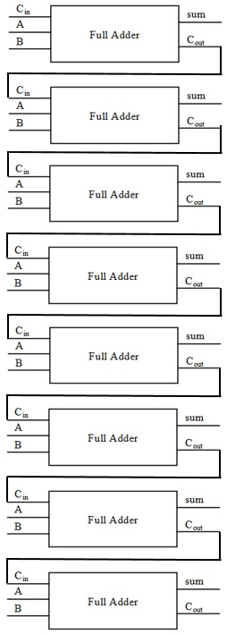

# 我的第五次作业
## 一、电路练习
**1. Give the three representations of an AND gate and say in your words what AND means.** 
  
&nbsp;&nbsp;&nbsp;&nbsp;**AND Gate** is a way to **judge** whether the two conditions are **both true** or not. If the conditions are both true, it will return **1**. Otherwise, it will return **0**.   

**2. Give the three representations of an XOR gate and say in your words what XOR means.**
  
&nbsp;&nbsp;&nbsp;&nbsp;**XOR Gate** is a way to judge whther **one** condition is **true** and **the other is false**. If one is true and the other is false, it will return **1**. Otherwise, it will return **0**.   
**3. Draw a circuit diagram corresponding to the following Boolean 
expression: (A + B)(B + C).**
(B+C).jpg "(A+B)(B+C)")   
**4. Show the behavior of the following circuit with a truth table.** 
  
.jpg "!A⊕(AB)")   
**5. What is circuit equivalence? Use truth table to prove the following formula.** 
**
(AB)'=A'+B'
** 
'.jpg "(AB)'") 
 
∵输入相同的A、B时，输出的结果相同 
∴ (AB)' = A'+B'   
**6. There are eight 1bit full adder integrated circuits. Combine them to 8bit adder circuit using the following box diagram.** 
   
**7. Logical binary operations can be used to modify bit pattern. Such as (X8X7X6X5X4X3X2X1)2 and (00001111)2 = (0000X4X3X2X1)2. We called that (00001111)2 is a mask which only makes low 4 bits to work.
Fill the follow expression.
**  
&nbsp;&nbsp;&nbsp;&nbsp;**(1)( X8X7X6X5X4X3X2X1 )2 or ( 00001111 )2 = ( X8X7X6X5X4X3X2X1 )2** 
&nbsp;&nbsp;&nbsp;&nbsp;**(2)( X8X7X6X5X4X3X2X1 )2 xor ( 00001111 )2 = ( X8X7X6X50000 )2** 
&nbsp;&nbsp;&nbsp;&nbsp;**(3)( ( X8X7X6X5X4X3X2X1 )2 and ( 11110000 )2 ) &nbsp;or&nbsp; ( &nbsp;not( X8X7X6X5X4X3X2X1 )2 &nbsp;and&nbsp; ( 00001111 )2 )= ( X8X7X6X50000)** 
## 二、维基百科
**1. Logic gate**  
&nbsp;&nbsp;&nbsp;&nbsp;In electronics, a logic gate is an idealized or physical device implementing a Boolean function; that is, it performs a logical operation on one or more binary inputs and produces a single binary output. Depending on the context, the term may refer to an ideal logic gate, one that has for instance zero rise time and unlimited fan-out, or it may refer to a non-ideal physical device (see Ideal and real op-amps for comparison).   
 **2.Boolean algebra**  
 &nbsp;&nbsp;&nbsp;&nbsp;In mathematics and mathematical logic, Boolean algebra is the branch of algebra in which the values of the variables are the truth values true and false, usually denoted 1 and 0 respectively. Instead of elementary algebra where the values of the variables are numbers, and the prime operations are addition and multiplication, the main operations of Boolean algebra are the conjunction and denoted as ∧, the disjunction or denoted as ∨, and the negation not denoted as **¬**. It is thus a formalism for describing logical relations in the same way that elementary algebra describes numeric relations. 
 ## 三、自学存储电路 
 **1.Flip-flop 
中文翻译：电子触发器**  
**2.How many bits information does a SR latch store?** 
&nbsp;&nbsp;&nbsp;&nbsp;Only one bit.