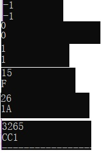

<center><font size="6">Problem Solving And Algorithm Design</font></center><br>

**<font size="5" color="#0000dd">Learn To Use Pseudocode </font>**<br><br>
**<font size="4">1.用伪代码描述将十进制转换成十六进制的方法</font>**<br>
```
    READ a Decimal number aa
    WHILE num>=1
        the least significant digit is equal to num%16
        num=num/16
    END WHILE
```

**<font size="4">2.C语言实现（先用注释写好算法，然后翻译）</font>**<br>

```
//用字符数组倒序储存十六进制的数，即hexNum[0]对应的是最高位的数字。每位的数字会等于输
入的数字取模，存储了该位数字之后将输入的数字除以16，再进行相同的运算，直到输入的数字小
于等于0

#include <stdio.h>

int main(){
	int copy,num,i,m=0,num2;
	char hexNum[30];
	
    scanf("%d",&num);
    num2=num;
	if(num<0){
		num=-num;
	}
	for(i=0;i<30;i++)
	    hexNum[i]='0';
	while(num){
	    if(num%16>=0&&num%16<=9)
			hexNum[m++]=num%16+'0';
		else if(num%16>=10&&num%16<=15)
			hexNum[m++]=num%16-10+'A';
	    num/=16;
	}
	if(num2>=0){
	if(num2==0)
		printf("0");
	else
		for(m=m-1;m>=0;m--)
	    	printf("%c",hexNum[m]);
	}
	else{
		printf("-");
		for(m=m-1;m>=0;m--)
		 	printf("%c",hexNum[m]);	
	}
}
```

**<font size="4">3.使用-1,  0,  1,  15,   26，3265作为输入测试你的程序</font>**<br>
<br><br><br><br>

**<font size="5" color="#006666">名词解释与对比</font>**<br><br>
**<font size="4">1.Top-down design</font>**<br>
<font size="3">&nbsp;&nbsp;&nbsp;&nbsp;&nbsp;&nbsp;&nbsp;&nbsp;Top-down and bottom-up are both strategies of information processing and knowledge ordering, used in a variety of fields including software, humanistic and scientific theories (see systemics), and management and organization. In practice, they can be seen as a style of thinking, teaching, or leadership.<br>
&nbsp;&nbsp;&nbsp;&nbsp;&nbsp;&nbsp;&nbsp;&nbsp;A top-down approach (also known as stepwise design and in some cases used as a synonym of decomposition) is essentially the breaking down of a system to gain insight into its compositional sub-systems in a reverse engineering fashion. In a top-down approach an overview of the system is formulated, specifying, but not detailing, any first-level subsystems. Each subsystem is then refined in yet greater detail, sometimes in many additional subsystem levels, until the entire specification is reduced to base elements. A top-down model is often specified with the assistance of "black boxes", which makes it easier to manipulate. However, black boxes may fail to clarify elementary mechanisms or be detailed enough to realistically validate the model. Top down approach starts with the big picture. It breaks down from there into smaller segments.</font><br>
<br><br>

**<font size="4">2.Work breakdown structure (WBS)</font>**<br>
<font size="3">&nbsp;&nbsp;&nbsp;&nbsp;&nbsp;&nbsp;&nbsp;&nbsp;A work-breakdown structure (WBS) in project management and systems engineering, is a deliverable-oriented breakdown of a project into smaller components. A work breakdown structure is a key project deliverable that organizes the team's work into manageable sections. The Project Management Body of Knowledge (PMBOK 5) defines the work-breakdown structure "A hierarchical decomposition of the total scope of work to be carried out by the project team to accomplish the project objectives and create the required deliverables."<br>
&nbsp;&nbsp;&nbsp;&nbsp;&nbsp;&nbsp;&nbsp;&nbsp;A work-breakdown structure element may be a product, data, service, or any combination thereof. A WBS also provides the necessary framework for detailed cost estimating and control along with providing guidance for schedule development and control.</font><br>
<br><br>
**<font size="4">3.简述管理学 WBS 与信息学 Top-down 设计的异同</font>**<br>
<font size="3">&nbsp;&nbsp;&nbsp;&nbsp;&nbsp;&nbsp;&nbsp;&nbsp;异：Top-down由上到下，WBS根据不同类别分成小的部分;<br>&nbsp;&nbsp;&nbsp;&nbsp;&nbsp;&nbsp;&nbsp;&nbsp;同：都是分解成子程序或者子系统来更深入的了解整个系统
</font><br><br><br><br>

**<font size="5" color="#660066">3、仔细观察您洗衣机的运作过程，运用Top-down设计方法和Pseudocode描述洗衣机控制程序。</font>**<br><br>
**<font size="4">假设洗衣机可执行的基本操作如下：<br>
water_in_switch(open_close)  // open 打开上水开关，close 关闭<br>water_out_switch(open_close)  // open 打开排水开关，close 关闭<br>get_water_volume()  // 返回洗衣机内部水的高度<br>motor_run(direction) // 电机转动。left 左转，right 右转，stop 停<br>time_counter()  // 返回当前时间计数，以秒为单位<br>halt(returncode) //停机，success 成功 failure 失败<br><br>1.请使用伪代码分解“正常洗衣”程序的大步骤。包括注水、浸泡等;<br>2.进一步用基本操作、控制语句（IF、FOR、WHILE等）、变量与表达式，写出每个步骤的伪代码;<br>3.根据你的实践，请分析“正常洗衣”与“快速洗衣”在用户目标和程序上的异同。你认为是否存在改进（创新）空间，简单说明你的改进意见？<br>4.通过步骤 3，提取一些共性功能模块（函数），简化“正常洗衣”程序，使程序变得更利于人类理解和修改维护。</font>**<br><br>
<font size="3">第一题：<br>1.选择洗衣的水位<br>2.注水：通过水位计限定水位<br>3.转动：左5次、右5次，计时器倒计时<br>4.浸泡：计时器倒计时<br>5.排水：水位计计录水位<br>（重复2-5步骤两次）6.转动：脱水，计时器倒计时<br>7.洗衣结束，发出报警声后机器关机</font><br><br>
<font size="3">第二题：<br></font><br>
```
    READ 用户要求注水水位
    times=0;
    REPEAT
        water_in_switch(open)                 //注水
    UNTIL get_water_volume() == 用户要求         
    
    water_in_switch(close)                    //停止注水
    
    REPEAT
        WHILE time_counter() is not equal to 0
            motor_run(left) for five times
            motor_run(right) for five times   //转动
        END WHILE

        WHILE time_counter() is not equal to 0
            The machine doesn't do anything   //浸泡
        END WHILE

        WHILE get_water_volume() is not equal to 0
            water_out_switch(open)            //排水
        END WHILE
        
        water_out_switch(close)               //停止排水
        
        INCREMENT times
    UNTIL times > 2

    REPEAT
        motor_run(left)                       //脱水
    UNTIL time_counter() is equal to 0

    halt(success)
```
<br>

<font size="3">第三题：<br>正常洗衣：用户目标：有较多时间待在家中或寝室中；<br>快速洗衣：用户目标：刚进行完运动需要及时将衣服清洗的人群；<br><br>二者异同：同：程序步骤基本相同；<br>&nbsp;&nbsp;&nbsp;&nbsp;&nbsp;&nbsp;&nbsp;&nbsp;&nbsp;&nbsp;&nbsp;&nbsp;&nbsp;&nbsp;&nbsp;&nbsp;&nbsp;&nbsp;&nbsp;&nbsp;&nbsp;异：浸泡、转动、脱水的时间不同，正常洗衣相对较长，因而清洗衣服较为干净<br><br>意见：加快转动的速度，让衣服能在快洗中更快被荡涤干净</font><br><br><br>
<font size="3">第四题：<br></font><br>
```
    wait(time):
    WHILE time is not equal to 0
        when 1 is add to time_counter() 
        time = time - 1
    END WHILE

    注水(volume,timeout)
    IF time_counter() = timeout AND get_water_volume() != volume
        halt(failure)
    END IF

    排水(timeout)
    IF time_counter() = timeout AND get_water_volume() != 0
        halt(failure)
    END IF
```


**<font size="5" color="#0000dd"></font>**<br><br>

**<font size="4"></font>**<br>

<font size="3"></font><br>

**<font size="5" color="#006666"></font>**<br><br>

**<font size="5" color="#660066"></font>**<br><br>

&nbsp;&nbsp;&nbsp;&nbsp;&nbsp;&nbsp;&nbsp;&nbsp;