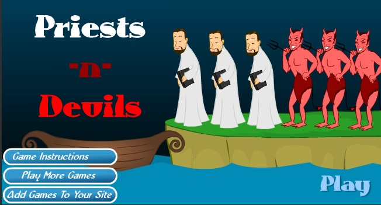

<center><font size="6">Problem Solving (Object Oriented Design)</font></center><br>

**<font size="5">根据“恶魔与牧师过河”游戏回答下列问题</font>**<br><br>
<br><br><br>
<font size="5" color="#0000dd">（1）游戏涉及哪些类，请列表说明</font><br><br>
**<font size="4">1.船；<br>2.河；<br>3.河岸；<br>4.牧师；<br>5.恶魔；<br>6.按钮；<br>7.计时器.</font>**<br><br>

<font size="5" color="#006666">（2）游戏中有哪些对象，各几个？</font><br><br>
**<font size="4">1.船：1个；<br>2.河：一条；<br>3.河岸：2个；<br>4.牧师：3个；<br>5.恶魔：3个；<br>6."GO"按钮：1个；<br>7."Time left"计时器：1个.</font>**<br><br>

<font size="5" color="#660066">（3）类和对象的区别是什么，请举一个例子说明。</font><br><br>
**<font size="4">&nbsp;&nbsp;&nbsp;&nbsp;&nbsp;&nbsp;&nbsp;&nbsp;类是指某一个种类的事物，而对象指的是某种事物的一个个体。<br>e.g. 类：牧师；<br>&nbsp;&nbsp;&nbsp; 对象：牧师1，牧师2，牧师3.</font>**<br><br>

<font size="5" color="#dd0000">（4）游戏中的魔鬼有哪些属性和方法</font><br>

**<font size="4">属性：</font>**<br>
<font size="3">1.图片；<br>2.名字；<br>3.大小；<br>4.位置；<br>5.动画；<br>6.动作.</font><br><br>
**<font size="4">方法：</font>**<br>
<font size="3">1.鼠标点击；<br>2.走动、翻转；<br>3.当船上与同一边岸上的恶魔数量之和多于牧师，用叉子击杀牧师.<br></font><br>

<font size="5" color="#00dd00">（5）假设魔鬼被鼠标点中，会执行onclick事件，请用文字（伪代码）描述这个事件中魔鬼与其他对象沟通的过程。</font><br><br>
```
    IF devil is onclick
        
        IF the devil is on the river bank which the boat is by AND the characters on the boat is less than 2
            perform the animation jumping,overturning,falling on the boat where is empty
        ELSE
            do nothing
        
        END IF
    END IF
```

<br>
<font size="5" color="#dddd00">（6）类或对象会是动词吗？</font><br><br>
<font size="4">不会。</font><br>
