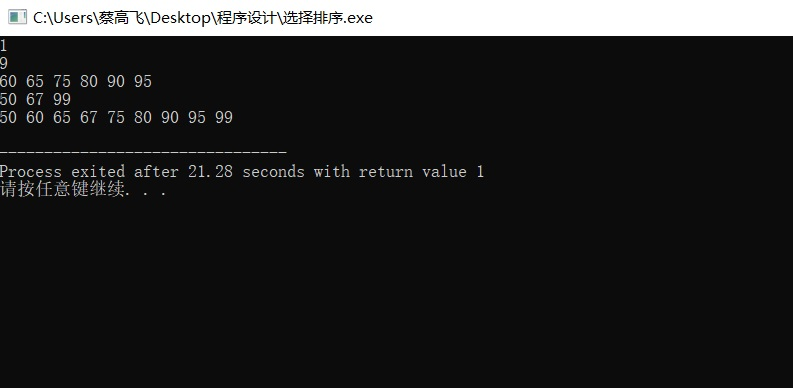

<center><font size="6">abstract_Data_Types_and_Algorithms</font></center><br>

<font size="4">1. Bubble Sort the list: 33, 56, 17, 8, 95, 22
。Make sure the final result is from small to large.Write out the list after the 2nd pass. (10 points) </font><br><br>
<font size="3">Answer: 8,17,33,56,22,95.</font><br><br>
<font size="4">2. Give a sorted array as list={60,65,75,80,90,95}. Design an algorithm to insert the value of x into the sorted array. Then test the algorithm with value 50,67,99.<br>
思考：为什么选择插入点在list头上、中间、尾巴上的三个数作为算法测试的数据，你能解释吗？</font><br><br>
```
    INPUT a number N
    k=1
    WHILE k < N THEN
        min = the k(th) number in the list
        j = k+1
        flag = k
        
        WHILE j < N THEN
            IF the j(th) number in the list < min
                min = the j(th) number in the list
                flag = j
                j = j+1
            END IF
        END WHILE
        
        tmp = the k(th) number of the list
        the k(th) number of the list = the flag(th) number of the list
        the flag(th) number of the list = tmp

        k = k+1
    END WHILE
```
<br><br>
<font size="3">思考:<br>头上：确定是否会忽略小于list中任何元素的情况；<br>中间：一般情况；<br>结尾：确定是否会忽略大于list中任何元素的情况。</font><br><br><br>
<font size="4">3. What is the state of the stack after the following sequence of Push and Pop operations?<br>Push “anne”; Push “get”; Push “your” ; Pop;  Push “my”  Push “gun”?</font><br><br>
<font size="3">Answer:<br>gun<br>my<br>get<br>anne<br></font><br><br>


<font size="3"></font><br><br>

<font size="4"></font><br><br>