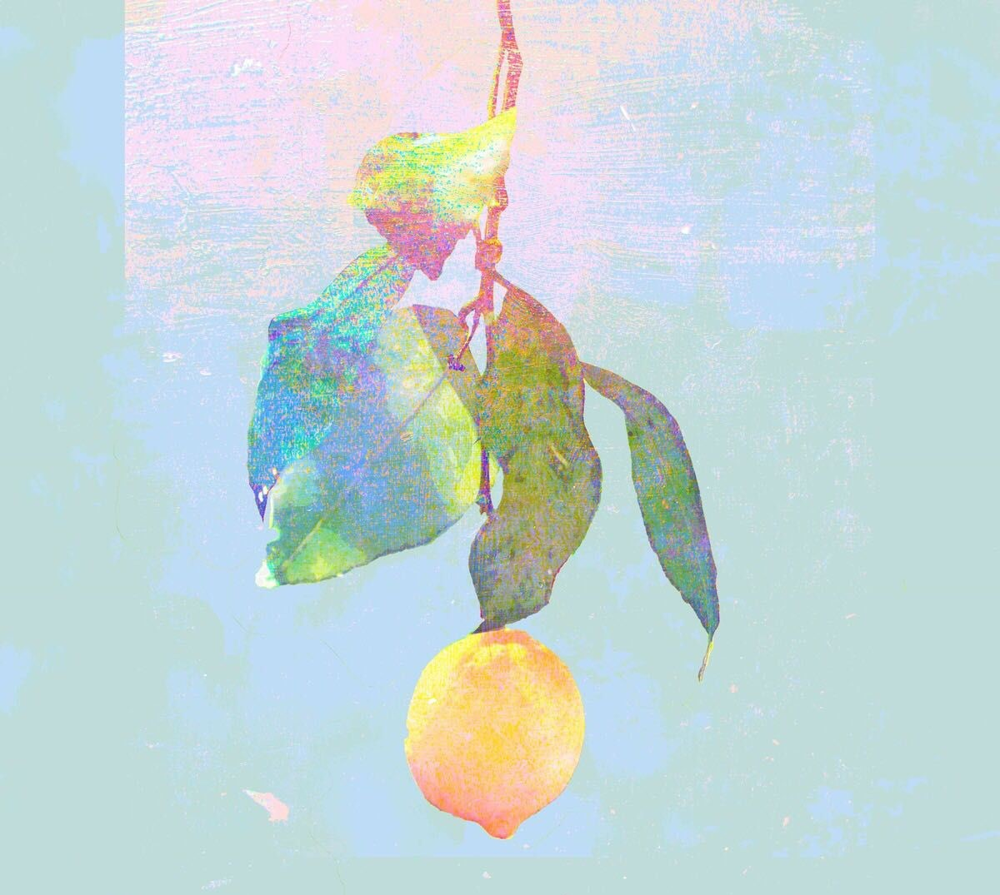
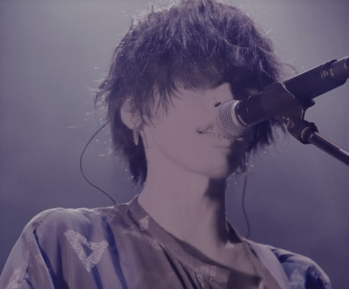
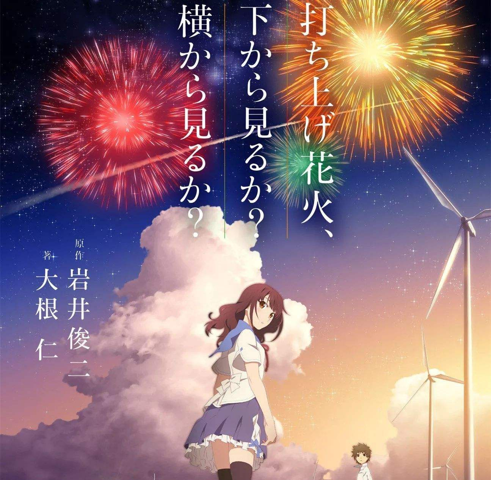

# Why can ***Lemon*** be so popular?
&nbsp;&nbsp;&nbsp;&nbsp;&nbsp;&nbsp;&nbsp;&nbsp;小伙伴们如果在最近逛过*bilibili*有一段时间（半年左右）的话，想来对于**Lemon**这首血洗b站的歌有一定的了解吧。
## 一、有关*Lemon*一点事
歌名|作者|歌手|专辑
---|--|--|---
Lemon|米津玄师(ハチ)|米津玄师师(ハチ)|Lemon
&nbsp;&nbsp;&nbsp;&nbsp;&nbsp;&nbsp;&nbsp;&nbsp;Lemon作为《*非自然死亡(Unnatural)*》的主题曲在2018年获得*第96届日剧学院赏最佳主题曲奖*，一周时间销量**30**万张，电子版下载量**75.2万**次，加起来总销量突破了**百万**，在日本以外的地区也大受瞩目，在中国反应亦是火爆。
&nbsp;&nbsp;
 
 
#### &nbsp;&nbsp;&nbsp;&nbsp;&nbsp;&nbsp;&nbsp;&nbsp;*Lemon*轻松的就破了百万达至 **传说LEGEND！** ,就算不逛b站的小伙伴也都能get到这首歌的强大了吧~~~~~~ &nbsp;&nbsp;&nbsp;&nbsp;&nbsp;&nbsp;&nbsp;&nbsp;那*for why?* 这首歌能做到这么吸引人呢？我想就是因为它的作者*米津玄师(ハチ)* 。
 

## 二、米津玄师 *(ハチ)*
中文名|外文名|职业|生日|血型|开始本名投稿时间
---|--|--|--|--|---
米津玄师|ハチ|音乐人|3月10日|O型|2012年02月20日

### 1、风格
&nbsp;&nbsp;&nbsp;&nbsp;&nbsp;&nbsp;&nbsp;&nbsp;ハチ的编曲多半是基于**电子合成器**与**打击乐**之上的，加上在vocaloid声音的后期制作上喜欢加入很明显的**镶边混响**效果，制造出**轻盈悦动、飘忽不定**的“电音场”，从而带给听众不可思议的听觉感受。这种无法被定性的音乐形式赋予其创作以独特的魔性，并加入**幻想风味**的抽象歌词及sense出众的PV动画后，构建起一个只属于ハチ的异色童话世界。
### 2、音乐人生涯
&nbsp;&nbsp;&nbsp;&nbsp;&nbsp;&nbsp;&nbsp;&nbsp;早期活跃在 ***niconico*** ,后转战**自作自唱**歌曲创作，从2009年至2011年投稿 ***VOCALOID*** 作品，此后从2012年02月20日起开始以本名“**米津玄师**”投稿自作自唱作品。
### 3、部分 ***百万*** 播放量达成曲目
1、结ンデ开イテ罗刹ト骸； 
2、clock lock works； 
3、Mrs.Pumpkinの滑稽な梦； 
4、ゴーゴー幽霊船； 
5、WORLD'S END UMBRELLA； 
6、砂の惑星； 
7、打上花火； 
8、Lemon.

## 三、*真正* 的for why问答
Q1：在收到创作主题曲的委托后，最初是怎样的印象呢？ 
&nbsp;&nbsp;&nbsp;&nbsp;&nbsp;&nbsp;&nbsp;&nbsp;很熟悉的东西,所以（在创作这些曲子时）一边回忆着小时候的事情一边就能写出来。但是对于电视剧我却没太接触过，读过剧本，就是单纯地觉得剧情“特别有趣”，大家都非常认真地对待这部作品。对于像我一样不怎么看电视剧的人也能感受到其中的能量。  
Q2：制作方有没有提出过“**想要这种曲调**”之类的要求？ 
&nbsp;&nbsp;&nbsp;&nbsp;&nbsp;&nbsp;&nbsp;&nbsp;关于细节的部分有提过几个需求，印象最深的是希望做出“**温柔地包围着受伤的人**”的氛围。最初是按这个标准开始创作的，结果最后弄出来的完全没那种感觉，就是一首述说“ ***你的离世我很悲伤*** ”的曲子。变成这样是因为遇到了很多事，最大的就是在作曲中途我的爷爷去世了。 
&nbsp;&nbsp;&nbsp;&nbsp;&nbsp;&nbsp;&nbsp;&nbsp;我是一个总是围绕着“死”歌唱的人，很熟悉怎么用音乐表达这件事。所以一开始就带着“这种主题的歌还是能写出来的吧”的情绪在创作，但在过程中我爷爷去世了，当直面**自己的亲人死去**的事实，我开始反思“ ***我真的能面对人类的死亡吗？*** ”，或许以前一直都处于含糊不清的状态。  
Q3：爷爷的离世对你来说是怎样的感觉呢? 
&nbsp;&nbsp;&nbsp;&nbsp;&nbsp;&nbsp;&nbsp;&nbsp;那时我正在巡演，在巡演中制作新曲也是第一次，很是**痛苦**。制作音乐就像一头扎进深海潜入最海底去取回东西的感觉。这个过程需要花费相当长的时间。但这次却必须在巡演的行程中进行创作,在我用力“**往下潜**”的时候，时限又到了，又得赶紧“**游出海面**”转换心情站上舞台，就这样来来回回 *不断重复*。就在这种状态下得知爷爷 ***去世*** 了，一团乱麻还不得不继续创作，在写歌时也总是在想我到底应该专注哪一边啊，那段时间确实是非常痛苦。 

### **总结** 

&nbsp;&nbsp;&nbsp;&nbsp;&nbsp;&nbsp;&nbsp;&nbsp;这首Lemon很“*私人化* ”（ハチ自己的意思），正因ハチ爷爷的逝世，让ハチ真正直面了死亡。 &nbsp;&nbsp;&nbsp;&nbsp;&nbsp;&nbsp;&nbsp;&nbsp;歌曲所展现的失去重要之人的难过与失落，无论是谁都能产生**代入感**。至亲的离去，让“死亡”这件事对你来说**不再是与己无关**。不再是追求达到“温柔的包围”的效果，而是站在直面过死亡的立场上去创作。 &nbsp;&nbsp;&nbsp;&nbsp;&nbsp;&nbsp;&nbsp;&nbsp;歌词中的“深深烙印在我心中的苦涩柠檬的香气”、“如同被切开的半个柠檬一般”，其中的 ***苦涩、失落与悲伤***，或许便是 ***Lemon*** 的**动人之处**。
