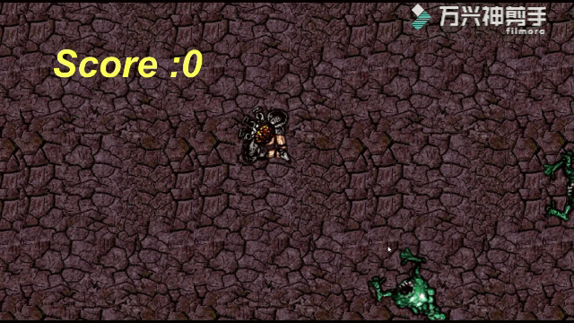
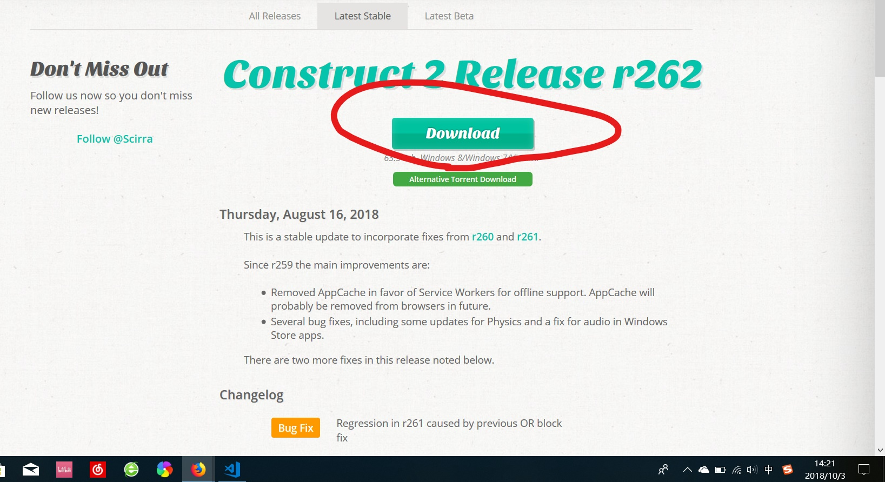
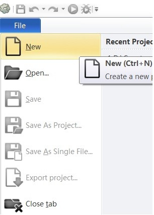
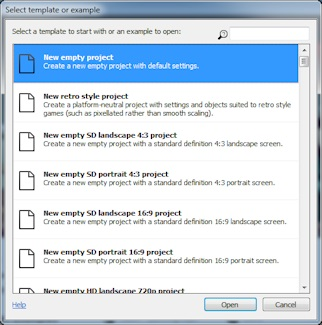

# *飞机打怪兽* 游戏制作入门教程
&nbsp;&nbsp;&nbsp;&nbsp;&nbsp;&nbsp;&nbsp;&nbsp;制作一个好游戏难吗？这个我敢肯定的说：“难”。但是，制作一个游戏难吗？这可就不一定了。我也是一个编程上的小白，然而借助工具(construct 2)的帮助，即便新手也能轻松做出一个小游戏的。 

## 一、安装construct 2
### 1、安装construct 2链接:  https://www.scirra.com/construct2/releases/r262
### 2、打开链接后，点击Download,如下图。    然后点击"保存文件"。当下载完成后，打开安装包，按照提示安装*construct 2*。 
## 二、游戏制作流程
### 1、打开链接: https://www.scirra.com/tutorials/37/beginners-guide-to-construct-2
### 2、创建新文件
&nbsp;&nbsp;&nbsp;&nbsp;&nbsp;&nbsp;&nbsp;&nbsp;打开**construct 2**软件，然后点击File,然后点击New如图。   点击"New empty project" 
### 3、背景制作
&nbsp;&nbsp;&nbsp;&nbsp;&nbsp;&nbsp;&nbsp;&nbsp;保存下方图片到本地   
双击空白处,然后双击"Tiled Background",之后点击任意空白处。   
点击"Load an image from a file"。   
在本地文件中选择刚刚保存的图片。打开后点击右上角的"X"，关闭小窗口。之后在右侧将"Position"调为"0,0"，将"Size"调为"1280,1024"。  按住ctrl键同时向下滑动鼠标滚轮，会看到这样的界面：   
### 4、添加层次
在界面右方偏上，点击layer。  
选中"layer 0"，点击“铅笔”的图标，将"layer 0"改名为"Background"，并点击“锁头”的图标将背景锁定不可选中。然后点击"十"的图标增加一层，并按上法改名为"Main"，最终结果如下。 
### 5、加入图标
双击空白处，双击选择"Sprite"，再点击空白处，并按之前**添加背景**的方式添加一下四个图标。 Player:  &nbsp;&nbsp;&nbsp;&nbsp;&nbsp;&nbsp;&nbsp;&nbsp;Monster:     bullet:&nbsp;&nbsp;&nbsp;&nbsp;&nbsp;&nbsp;&nbsp;&nbsp;&nbsp;&nbsp;&nbsp;&nbsp;&nbsp;&nbsp;&nbsp;&nbsp;&nbsp;&nbsp;&nbsp;&nbsp;&nbsp;&nbsp;&nbsp;&nbsp;&nbsp;&nbsp;&nbsp;&nbsp;&nbsp;&nbsp;&nbsp;&nbsp;&nbsp;Explosion:   
从"Layer"调回"Project"，将各图标的名称从"Sprite 1/2/3/4"改为各自对应名称如"Player"。 
### 6、添加动作
单击你已添加的Player的图标，在左侧"Edit behaviour"旁点击"Add/Edit"。   
双击"8 Direction"。   
同理，为"Player"添加"Scroll To"和"Bound To Layout"。   
同样的： 为"Bullet"添加"Bullet Movement"和"Destroy Outside Layout"动作; 为"Monster"添加"Bullet movement"动作; 为"Explosion"添加"Fade"动作。  
单击"Monster"图标，在左侧的"Behaviors"处将"Speed"从400改至80。 同法， 将"Bullet"的"Speed"改至600； 将"Explosion"的"Fade Out time"改至0.5。  
**将"Bullet"和"Explosion"图标移动到背景外部黑色部分，以免在游戏中出现。**
### 7、增加Monster
按住ctrl键同时鼠标左键点击"Monster"图标，拖拽后松开，连续复制出7-8个"Monster"，排布最好如图。 
### 8、添加活动(Event)
#### 1、让Player可移动
在左上角偏下处，点击"Event sheet 1"。   
双击空白处，双击"System"。   
双击"Every tick"   
点击"Add action"，双击"Player"   
然后双击"Set angle toward position"。   
将X与Y的值分别输入为Mouse.X, Mouse.Y。   
最后点击"Done"，结果会是下图 
#### 2、射出Bullet
双击空白处，双击"Mouse"，双击"On click"，选择"Left clicked"。  
点击"Add action"，双击"Player"，双击"Spawn another object"，"Object"选择"Bullet"，"Layer"输入1，"Image point"输入0，结果如下。   
右键点击"Player"图标，单击"Edit animations"，点击"Set origin or image point"图标：&nbsp;&nbsp;&nbsp;&nbsp;&nbsp;&nbsp;&nbsp;&nbsp;再点击"Player"的炮口:   
#### 3、让Bullet能杀了Monster
在"Event sheet 1"层双击空白处，双击"Bullet"，双击"On collision with another object"，"Objecy"选择"Monster"； 
点击"Add action"，双击"Monster",双击"Destroy"； 
点击"Add action",双击"Bullet"，双击"Spawn another object"，"Object"选择"Explosion"，"Layer"输入1; 
点击"Add action"，双击"Bullet"，双击"Destroy"。
#### 4、调整爆炸效果
在"Layout 1"层点击"Explosion"图标，在左侧的"Blend mood"旁将"Normal"修改为"Additive"。
#### 5、让怪物更聪明
在"Event sheet 1"层双击空白处，双击"System"，双击"On start of Layout"； 
点击"Add action"，双击"Set angle"，"random"设置为360。  
双击空白处，双击"Monster"，双击"Is outside layout"。 
点击"Add action"，双击"Monster"，双击"Set angle toward position"，"X","Y"分别输入Play.X与Player.Y。
#### 6、调节怪物血量
**一、**  在"Layout 1"层点击"Monster"图标，在左侧"Edit variables"旁点击"Add/Edit",再点击"十"图标   
将"Name"改为"Health"，再将"Initial value"输入为5   
**二、改变活动(Event)**  在"Event sheet 1"层右键"Monster Destroy",点击"Replace"   
双击"Monster"，双击"Subtract from"，将Instant variable输入为"Health"，Value输入1，点击"Done"   
双击空白处，双击"Monster"，双击"Compare instance variable"，选择"Health"与"Less or equal 0"； 
点击"Add action"，双击"Monster"，双击"Spawn another object"，选择"Explosion"，"Layer"输入1； 
点击"Add action"，双击"Monster"，双击"Destroy"。 
#### 7、获得得分
在"Event sheet 1"层右键，点击"Add globle variable"   
"Name"改为"Score"，"Initial value"输入0   
在"Monster:health less or equal 0"的活动(Event)中点击"Add action"，双击"System"，双击"Add to"，选择"Score"，"Value"输入为1   
#### 8、增加计分层
在"Layer 1"处增加多一层并改名为"HUD"； 
在"Layout 1"处双击空白处，双击"Text"，并将其放在左上角，调节字体   
在"Event sheet 1"层的"Every tick"活动(Event)前add action：双击"Text"，双击"Set text"，输入"Score:"&Score。
#### 9、怪物复活机制
"Event sheet 1"层双击空白处，双击"System"，双击"Every X seconds"，输入3； 
点击"Add action"，双击"System"，双击"Create object"，选择"Monster"，"Layer"输入为1，"X"，"Y"分别输入为1400，random(1024)； 
双击空白处，双击"Monster"，双击"On collision with another object"，选择"Player"； 
点击"Add action"，双击"Player"，双击"Destroy"。  
### 到此为止，一个游戏就制作完了，是不是挺简单的呢？对于自己做的一个小游戏，有什么感想呢？只要克服了心里的一些小障碍，小伙伴们想必会发现更宽广的世界吧。为美好的世界献上祝福!