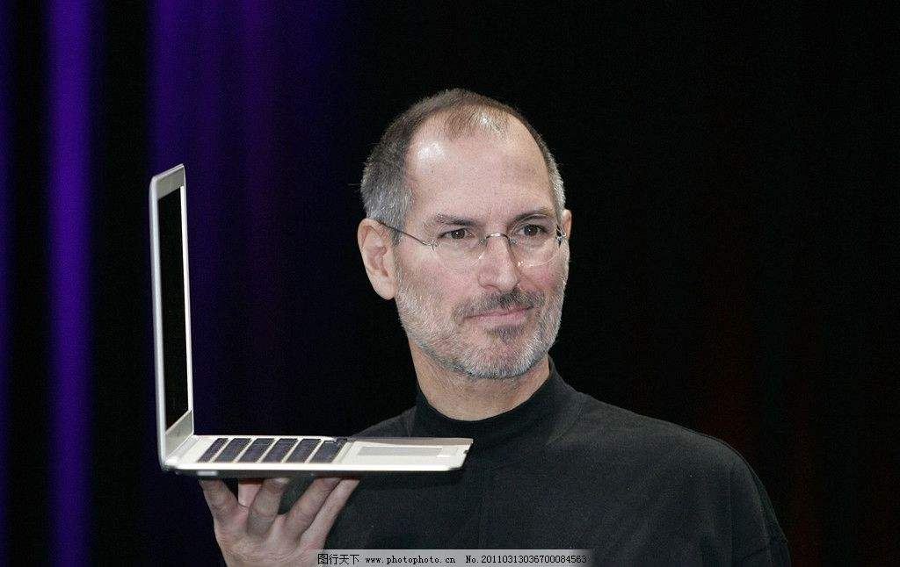

# 古今 计算机IT 史上的重要人物
## 一、《电脑周刊》发表的IT界十大最伟大人物
### 1、史蒂夫·乔布斯——苹果创办人
 
&nbsp;&nbsp;&nbsp;&nbsp;&nbsp;&nbsp;&nbsp;&nbsp;**史蒂夫·乔布斯**（Steve Jobs，1955年2月24日—2011年10月5日），出生于美国加利福尼亚州旧金山，美国发明家、企业家、美国苹果公司联合创办人。  
&nbsp;&nbsp;&nbsp;&nbsp;&nbsp;&nbsp;&nbsp;&nbsp;1976年4月1日，乔布斯签署了一份合同，决定成立一家电脑公司。1977年4月，乔布斯在美国第一次计算机展览会展示了苹果Ⅱ号样机。1997年苹果推出iMac，创新的外壳颜色透明设计使得产品大卖，并让苹果度过财政危机。2011年8月24日，史蒂夫·乔布斯向苹果董事会提交辞职申请。  
&nbsp;&nbsp;&nbsp;&nbsp;&nbsp;&nbsp;&nbsp;&nbsp;乔布斯被认为是计算机业界与娱乐业界的标志性人物，他经历了苹果公司几十年的起落与兴衰，先后领导和推出了麦金塔计算机（Macintosh）、iMac、iPod、iPhone、iPad等风靡全球的电子产品，深刻地改变了现代通讯、娱乐、生活方式。乔布斯同时也是前Pixar动画公司的董事长及行政总裁。
### 2、蒂姆·伯纳斯·李
 

&nbsp;&nbsp;&nbsp;&nbsp;&nbsp;&nbsp;&nbsp;&nbsp;**蒂莫西·约翰·“蒂姆”·伯纳·李爵士**（Tim Berners-Lee），OM，KBE，FRS，FREng，FRSA，（Sir Timothy John "Tim" Berners-Lee，1955年6月8日－），英国计算机科学家。 
&nbsp;&nbsp;&nbsp;&nbsp;&nbsp;&nbsp;&nbsp;&nbsp;他是万维网的发明者，南安普顿大学与麻省理工学院教授。1990年12月25日，罗伯特·卡里奥在CERN和他一起成功通过Internet实现了HTTP代理与服务器的第一次通讯。 
&nbsp;&nbsp;&nbsp;&nbsp;&nbsp;&nbsp;&nbsp;&nbsp;万维网联盟（W3C）是伯纳斯·李为关注万维网发展而创办的组织，并担任万维网联盟的主席。他也是万维网基金会的创办人。伯纳斯-李还是麻省理工学院计算机科学及人工智能实验室创办主席及高级研究员。同时，伯纳斯-李是网页科学研究倡议会的总监。最后，他是麻省理工学院集体智能中心咨询委员会成员。 
&nbsp;&nbsp;&nbsp;&nbsp;&nbsp;&nbsp;&nbsp;&nbsp;2004年，英女皇伊丽莎白二世向伯纳斯·李颁发大英帝国爵级司令勋章。2009年4月，他获选为美国国家科学院外籍院士。在2012年夏季奥林匹克运动会开幕典礼上，他获得了“万维网发明者”的美誉。伯纳斯·李本人也参与了开幕典礼，在一台NeXT计算机前工作。他在Twitter上发表消息说：“这是给所有人的”，体育馆内的LCD光管随即显示出文字来。2017年，他因“发明万维网、第一个浏览器和使万维网得以扩展的基本协议和算法”而获得2016年度的图灵奖。
### 3、比尔·盖茨——微软创始人
 
&nbsp;&nbsp;&nbsp;&nbsp;&nbsp;&nbsp;&nbsp;&nbsp; **比尔·盖茨** （Bill Gates），全名威廉·亨利·盖茨三世，简称比尔或盖茨。1955年10月28日出生于美国华盛顿州西雅图，企业家、软件工程师、慈善家、微软公司创始人。曾任微软董事长、CEO和首席软件设计师。 
&nbsp;&nbsp;&nbsp;&nbsp;&nbsp;&nbsp;&nbsp;&nbsp;比尔·盖茨13岁开始计算机编程设计，18岁考入哈佛大学，一年后从哈佛退学，1975年与好友保罗·艾伦一起创办了微软公司，比尔盖茨担任微软公司董事长、CEO和首席软件设计师。 
&nbsp;&nbsp;&nbsp;&nbsp;&nbsp;&nbsp;&nbsp;&nbsp;比尔·盖茨1995-2007年连续13年成为《福布斯》全球富翁榜首富，连续20年成为《福布斯》美国富翁榜首富。 
2000年，比尔·盖茨成立比尔和梅琳达·盖茨基金会，2008年比尔盖茨宣布将580亿美元个人财产捐给慈善基金会，2014年比尔·盖茨辞去董事长一职，并击退卡洛斯·斯利姆重回世界首富。  
&nbsp;&nbsp;&nbsp;&nbsp;&nbsp;&nbsp;&nbsp;&nbsp;2015年美国当地时间9月29日，《福布斯》发布美国富豪400强榜单显示，微软公司创始人盖茨凭借760亿美元净资产，连续第22年高居榜首。  
&nbsp;&nbsp;&nbsp;&nbsp;&nbsp;&nbsp;&nbsp;&nbsp;2016年3月1日，福布斯公布了最新一期全球富豪榜单，虽然比尔·盖茨的个人财富比2015年少了42亿美金，但他这次以750亿美金个人财富仍连续三年位居榜首。2016年10月，《福布斯》发布“美国400富豪榜”，比尔·盖茨以资产810亿美元，第23年蝉联榜首。  
&nbsp;&nbsp;&nbsp;&nbsp;&nbsp;&nbsp;&nbsp;&nbsp;2018年3月6日，福布斯2018富豪榜发布，比尔·盖茨以900亿美元排名第二。
