# 
技术科普 JavaScript

&nbsp;&nbsp;&nbsp;&nbsp;&nbsp;&nbsp;&nbsp;&nbsp;小伙伴们，在这里我要 introduce 的是一门编程语言：JavaScript。对于编程语言，广为人知的便是 C、C++、Python、Java 和 JavaScript 了。那么 JavaScript 到底是一门怎样的语言呢？我就在这简单地介绍一下吧 (毕竟我也是一枚小白呀~~~~~~ )。
# JavaScript 简介
&nbsp;&nbsp;&nbsp;&nbsp;&nbsp;&nbsp;&nbsp;&nbsp;**JavaScript** 是一种直译式脚本语言，是一种动态类型、弱类型、基于原型的语言，内置支持类型。它的解释器被称为 JavaScript 引擎，为浏览器的一部分，广泛用于客户端的脚本语言，最早是在 **HTML**（标准通用标记语言下的一个应用）网页上使用，用来给 HTML 网页增加动态功能。 
&nbsp;&nbsp;&nbsp;&nbsp;&nbsp;&nbsp;&nbsp;&nbsp;在1995年时，由 **Netscape** 公司的 Brendan Eich，在网景领航者浏览器上首次设计实现而成。因为 Netscape 与 Sun 合作，Netscape 管理层希望它外观看起来像 Java，因此取名为 JavaScript。但实际上它的语法风格与 Self 及 Scheme 较为接近。  
&nbsp;&nbsp;&nbsp;&nbsp;&nbsp;&nbsp;&nbsp;&nbsp;为了取得技术优势，微软推出了JScript，CEnvi 推出 ScriptEase，与 JavaScript 同样可在浏览器上运行。为了统一规格，因为 JavaScript 兼容于 ECMA 标准，因此也称为 **ECMAScript** (简称 **ES** )。 

# JavaScript基础语法
## 1、三条基本指令
&nbsp;&nbsp;&nbsp;&nbsp;&nbsp;&nbsp;&nbsp;&nbsp;JavaScript 是一门与浏览器密切相关的语言，适用于前端处理。以下便是 JavaScript最常用的三条基本的指令：
### （一）alert 警告框指令
&nbsp;&nbsp;&nbsp;&nbsp;&nbsp;&nbsp;&nbsp;&nbsp;语法： &nbsp;&nbsp;***alert("你需要弹出的内容")*** 
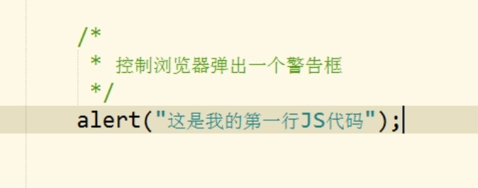 
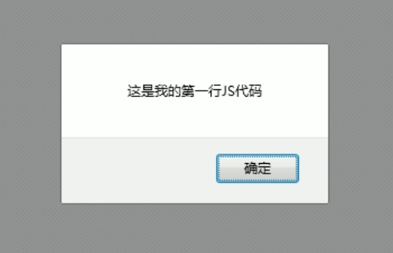  
### （二）document.write 文本指令
&nbsp;&nbsp;&nbsp;&nbsp;&nbsp;&nbsp;&nbsp;&nbsp;语法：&nbsp;&nbsp;***document.write("你要写入的内容")*** 
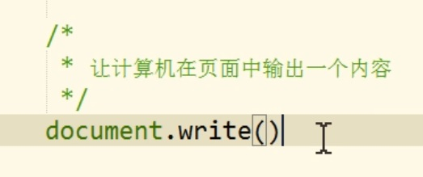 
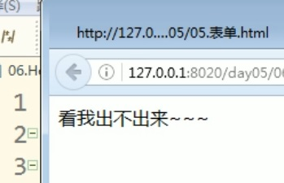  
### （三）console.log 控制台指令
&nbsp;&nbsp;&nbsp;&nbsp;&nbsp;&nbsp;&nbsp;&nbsp;语法：&nbsp;&nbsp; ***console.log("你要写入的内容")***  
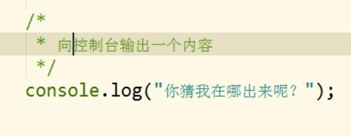 
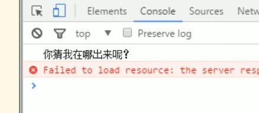  
## 2、JavaScript 基本语法
### （1）注释
&nbsp;&nbsp;&nbsp;&nbsp;&nbsp;&nbsp;&nbsp;&nbsp;分为了 **多行注释** 和 **单行注释** 
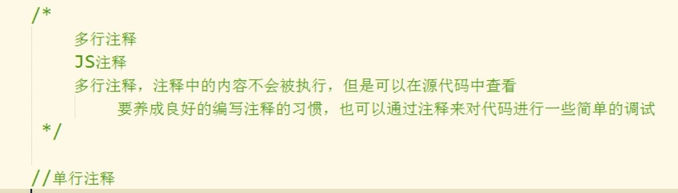  
### （2）JS中严格区分大小写
### （3）JS中每条语句以（ ; ）结尾
&nbsp;&nbsp;&nbsp;&nbsp;&nbsp;&nbsp;&nbsp;&nbsp;1、如果不以（ ; ）结尾,浏览器会自动添加，但是会消耗一些资源； 
&nbsp;&nbsp;&nbsp;&nbsp;&nbsp;&nbsp;&nbsp;&nbsp;2、有些时候，浏览器会加错分号,导致程序语义出现错误。
### （4）JS中会忽略多个空格与换行，所以我们可以利用空格与换行对代码进行格式化
## 3、JavaScript 基本概念
### （1）字面量和变量
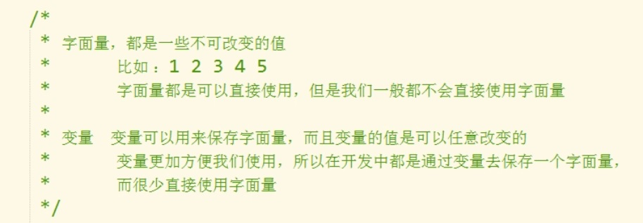  
在JS中，使用 var 来声明一个变量 
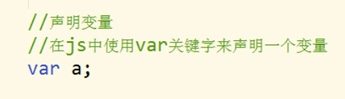  
使用 = 进行变量赋值，并且声明与赋值可同时进行 
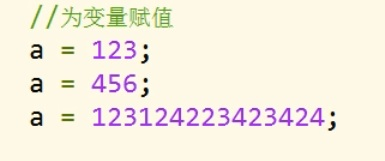  
### （2）字符串
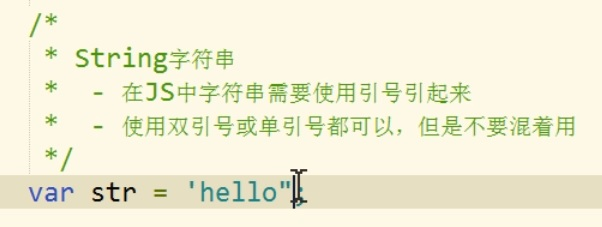 
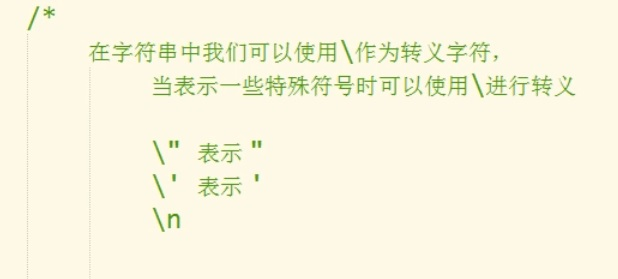  
### （3）标识符
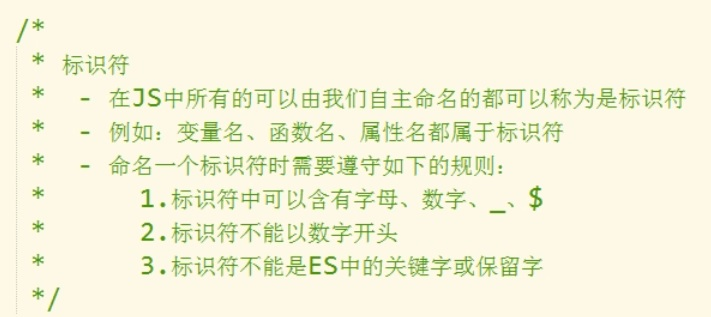  
## 4、JavaScript 数据类型
### （1）六种数据类型一览
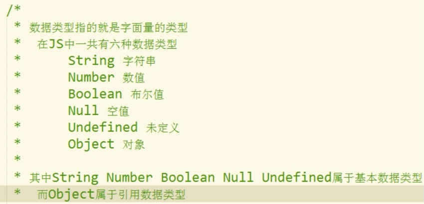  
其中有 **五种** 数据类型被称为 **基本数据类型**  
### （2）基本数据类型介绍
#### 1、String
&nbsp;&nbsp;&nbsp;&nbsp;&nbsp;&nbsp;&nbsp;&nbsp;即 **字符串**，介绍如上
#### 2、Number
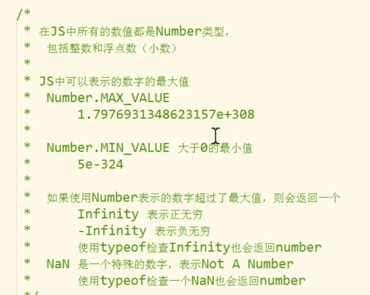  
**Typeof** 运算符的使用 
  
#### 3、布尔值
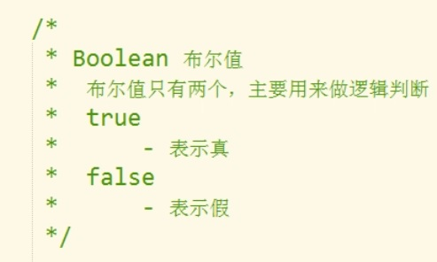  
#### 4、null 和 undefined
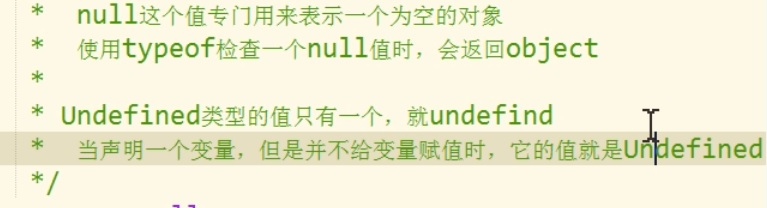  
### （3）强制数据类型转换
#### 1、强制转换为 Number
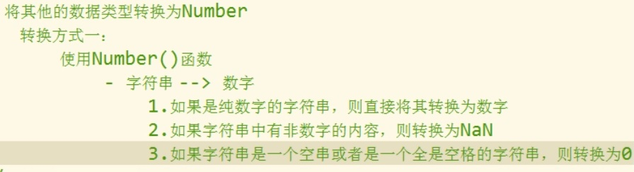 
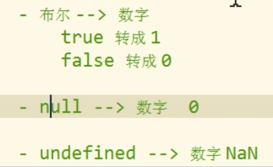  
#### 2、强制转换为 String
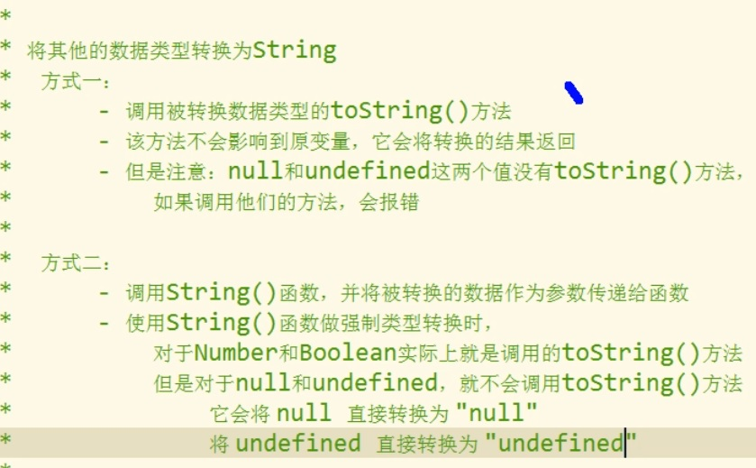  
#### 3、强制转换为 Boolean
  
&nbsp;&nbsp;&nbsp;&nbsp;&nbsp;&nbsp;&nbsp;&nbsp;小伙伴们，初识JavaScript有什么感受吗？有没感到 dokidoki 心脏乱跳呢？这里我们接触的都是 基础中的基础。 如果小伙伴真的感到了小鹿乱撞，那就自己接着去更深入地了解它吧！