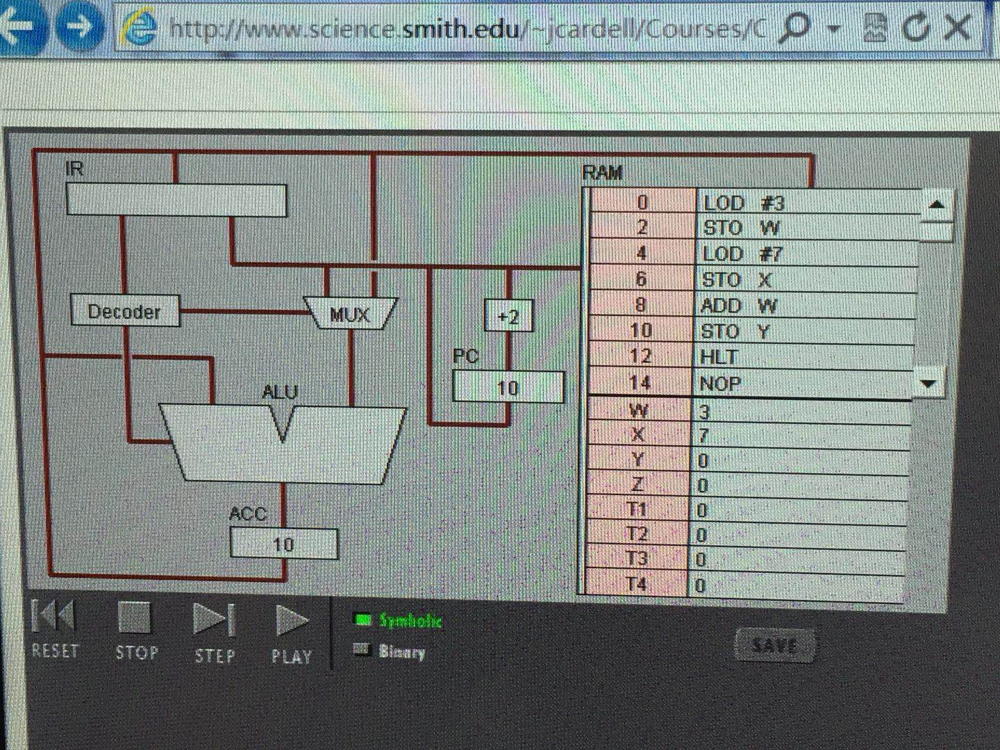
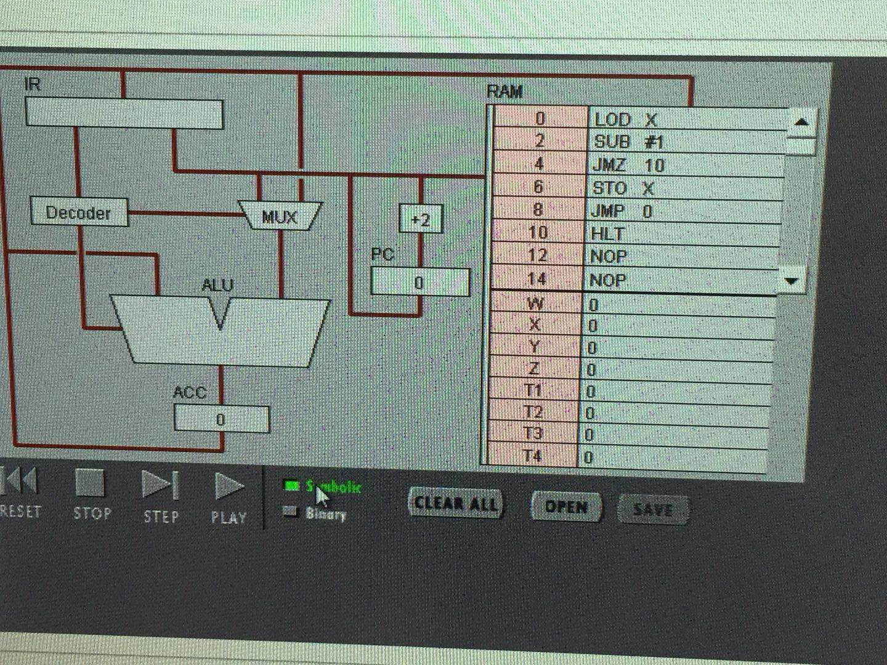

**<center><font size="6">机器语言实验报告</font></center>**<br><br>
**<font size="5">Task 1</font>**<br><br>
**<font size="4">（1）输入 Program 1：Add 2 number</font>**<br>
<br><br>
**<font size="4">（2）点step after step。观察并回答下面问题：</font>**<br><br>
**<font size="3">1.PC，IR 寄存器的作用。<br>2.ACC 寄存器的全称与作用。<br>3.用“LOD #3”指令的执行过程，解释Fetch-Execute周期。<br>4.用“ADD W” 指令的执行过程，解释Fetch-Execute周期。<br>5.“LOD #3” 与 “ADD W” 指令的执行在Fetch-Execute周期级别，有什么不同。</font>**<br><br>

<font size="3">**Answer:** <br>1.PC：总是指向下一条指令，从而做到调取下一条指令；<br>&nbsp;&nbsp;&nbsp;IR寄存器：用于寄存当前执行的指令；<br>2.ACC寄存器：全称：Accumulator（累加器）；<br>&nbsp;&nbsp;&nbsp;&nbsp;&nbsp;&nbsp;&nbsp;&nbsp;&nbsp;&nbsp;&nbsp;&nbsp;&nbsp;&nbsp;&nbsp;&nbsp;&nbsp;&nbsp;&nbsp;&nbsp;&nbsp;&nbsp;&nbsp;&nbsp;作用：将每条指令运行结果累加起来；<br>3.①读取指令；<br>&nbsp;&nbsp;&nbsp;②解析( decode )指令；<br>&nbsp;&nbsp;&nbsp;③指令传入IR，指令传入Decoder，无需取址，数字3传入MUX；<br>&nbsp;&nbsp;&nbsp;④数字3传入ALU之后传入ACC；<br>4.①读取指令；<br>&nbsp;&nbsp;&nbsp;②解析( decode )指令；<br>&nbsp;&nbsp;&nbsp;③ALU从ACC中读取数值；<br>&nbsp;&nbsp;&nbsp;④访问 W 地址，读取 W 数值；<br>&nbsp;&nbsp;&nbsp;⑤执行“加”的指令后传入 ACC；<br>5. LOD #3 只需访问一次 RAM，即最开始调用指令需要访问；<br>&nbsp;&nbsp;&nbsp; ADD W 需要访问两次 RAM，即 调用指令 与 访问 W 地址的时候。</font><br><br>
**<font size="4">（3）点击“Binary”,观察回答下面问题</font>**<br><br>
**<font size="3">1.写出指令 “LOD #7” 的二进制形式，按指令结构，解释每部分的含义。<br>2.解释 RAM 的地址。<br>3.该机器CPU是几位的？（按累加器的位数）<br>4.写出该程序对应的 C语言表达。</font>**<br><br>
<font size="3">1. 00010100 00000111；<br>&nbsp;&nbsp;&nbsp;前八位：000x zzzz：x指寻址模式："1"表示操作数是数值；"2"表示操作数是该地址的内容； zzzz指的是操作码；<br>&nbsp;&nbsp;&nbsp;后八位：bbbbbbbb 则是一个数值或者是一个地址；<br>2.RAM 的地址是一串 **八位** 的 **二进制** 数字，只用于暂时存放数据，一旦停机，则会丢失数据；<br>3. 8位；<br>4.</font><br>
```C
    #include <stdio.h>

    int main(){
        int W = 3,X = 7;
        int Y = X + W;

        return 0;
    }
```

<br><br>

**<font size="5">Task 2</font>**<br><br>
**<font size="4">（1）输入程序Program 2，运行并回答问题：</font>**<br><br>
**<font size="3">1.用一句话总结程序的功能<br>2.写出对应的 c 语言程序</font>**<br><br>
<br><br>
<font size="3">1. X 递减至 0 时结束；<br>2.</font><br>
```C
    #include <stdio.h>

    int main(){
        int x = 3;

        while(x){
            x--;
        }

        return 0;
    }
```

<br>

**<font size="4">（2）修改该程序，用机器语言实现 10+9+8+..1 ，输出结果存放于内存 Y</font>**<br><br>
**<font size="3">1.写出 c 语言的计算过程<br>2.写出机器语言的计算过程<br>3.用自己的语言，简单总结高级语言与机器语言的区别与联系。</font>**<br><br>
<font size="3">1.</font><br>
```C
    #include <stdio.h>

    int main(){
        int x = 10,Y = 0;

        for(;x > 0;x--){
            Y += X;
        }

        return 0;
    }
```


<font size="3">2.</font><br>
```
    //汇编语言
00    LOD #10
02    STO X
04    LOD #0
06    STO Y
08    LOD X
10    ADD Y
12    STO Y
14    LOD X
16    SUB #1
18    STO X
20    JMZ 24
22    JMP 08
24    HLT

    //机器语言
00000000     00010100 00001010
00000010     00000101 10000001
00000100     00010001 00000001
00000110     00000101 10000000
00001000     00000000 10000001
00001010     00000101 10000000
00001100     00000100 10000000
00001110     00001101 00010010
00010000     00001100 00000100
00010010     00000101 10000010
00010100     00001111 00000000
00010110     00001110 00000000
00011000     00001110 00000000
```

<font size="3">3.区别：高级语言更人性化，利于人类阅读与编写；<br>&nbsp;&nbsp;&nbsp;&nbsp;&nbsp;&nbsp;&nbsp;&nbsp;&nbsp;&nbsp;&nbsp;&nbsp;&nbsp; 机器语言是以 0、1 为单位的语言，十分反人类，是给机器阅读的语言；<br>&nbsp;&nbsp;&nbsp;联系：我们平常使用的高级语言需要通过 **编译** 转化为机器语言以供给机器阅读，同样可实现 顺序、条件选择、循环迭代。</font><br>


