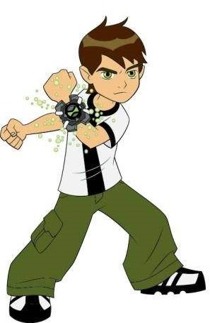
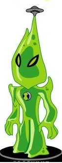
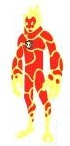

**
“Ben 10的守护”游戏制作
**  

   

**游戏背景**

&nbsp;&nbsp;&nbsp;&nbsp;&nbsp;&nbsp;&nbsp;&nbsp;Ben 10 是一位十岁大的男孩，他的生活因为一个撞上地球的陨石而永远改变。从天而降的陨石带来了 Omnitrix，让他拥有变身成十种以上外星英雄的能力，而每一个英雄都有独特的神奇力量。自此，小班成为一个超级英雄。在爷爷马克与堂妹小玟的帮助下，小班肩负起保卫世界的任务。此时，Ben 10和他的朋友忽然遭遇怪物的袭击，他的朋友 **受伤了不能移动**，因此 Ben 10 只能尽全力守护 **在朋友身边** 直到支援的到来。  

**玩法**

&nbsp;&nbsp;&nbsp;&nbsp;&nbsp;&nbsp;&nbsp;&nbsp;游戏中的player **Ben 10** 由玩家操控，点击一次鼠标左键会朝着鼠标的方向射出一发子弹。 
&nbsp;&nbsp;&nbsp;&nbsp;&nbsp;&nbsp;&nbsp;&nbsp;游戏中有两种怪物： 一种是绿色怪物，有 **3滴血**；另一种是更大的红色怪物，有 **8滴血**。 
&nbsp;&nbsp;&nbsp;&nbsp;&nbsp;&nbsp;&nbsp;&nbsp;每发子弹击中怪物会造成 **1 点伤害**。 
&nbsp;&nbsp;&nbsp;&nbsp;&nbsp;&nbsp;&nbsp;&nbsp;当其中一种怪物 **碰撞** 到 **Ben 10** 或者 **他的朋友**，游戏结束；  &nbsp;&nbsp;&nbsp;&nbsp;&nbsp;&nbsp;&nbsp;&nbsp;当在 **击败40名敌人** 后 **Ben 10** 和 **他的朋友** 仍未被碰撞到，则游戏胜利; 
&nbsp;&nbsp;&nbsp;&nbsp;&nbsp;&nbsp;&nbsp;&nbsp;游戏过程中会出现 **游戏道具**，用子弹 **击中** 游戏道具可以杀死 **当前屏幕内** 的所有怪物。    

**游戏CRC卡片**
  

**Ben 10**

Object name: Ben 10 Collaborator：Sprite Events & Actions：射出子弹，消灭怪物 
Attribute: 
  

**Ben 10的朋友**

Object name: 楪祈 Collaborator：Sprite Events & Actions：卧倒在地，被怪物碰撞后游戏结束 
Attribute: 
  

**Green Monster**

Object name: Green Monster Collaborator：Sprite Events & Actions：有3滴血，向 Ben 10 和 楪祈 撞击 
Attribute: 
  

**Red Monster**

Object name: Red Monster Collaborator：Sprite Events & Actions：有8滴血，向 Ben 10 和 楪祈 撞击 
Attribute: 
  

**Bullet**

Object name: Bullet Collaborator：Sprite Events & Actions：向鼠标点击的位置沿直线移动，碰撞到怪物后消失并使怪物失去一滴血 
Attribute: 
    

**游戏设计**

&nbsp;&nbsp;&nbsp;&nbsp;&nbsp;&nbsp;&nbsp;&nbsp;设置好在森林中的背景之后，添加入CRC卡片，并赋予各个角色所需要的属性以及行为。如 “朋友” 卧倒不可移动； Ben 10 要守护在朋友身边因此也不可移动； 子弹沿直线飞行； 怪物朝着 Ben 10 和 他的朋友冲来； 怪物的血量等等。待这些工作做完后，一个简单地小游戏就做出来了。
