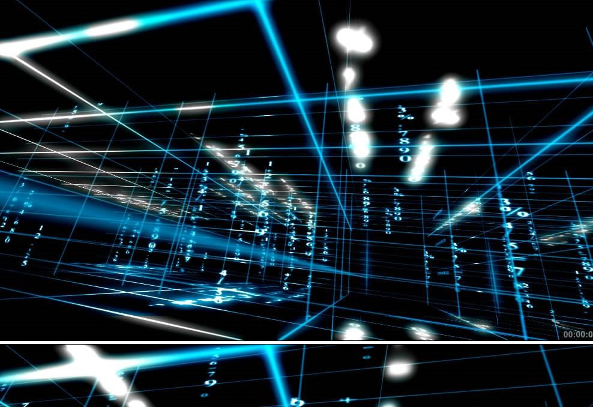

# 
程序“猿”之死

&nbsp;&nbsp;&nbsp;&nbsp;&nbsp;&nbsp;&nbsp;&nbsp;在很多小伙伴们看来，程序“猿”们都是些高大上的存在吧。在程序“猿”的眼中，一台电脑、一根网线、一个键盘、一个鼠标就是一个能够改变世界的神器，不合心意时便能神挡杀神，佛挡杀佛。 

  

&nbsp;&nbsp;&nbsp;&nbsp;&nbsp;&nbsp;&nbsp;&nbsp;确实，在现实中，技术拥有着难以想象的力量，有着能够改变整个世界的魔能。然而，技术不是无所不能的。即便是强大的程序“猿”，也无法保证能够凭借着手中的代码，在世界找到安全而幸福的桃花源地。  

苏享茂之死  

&nbsp;&nbsp;&nbsp;&nbsp;&nbsp;&nbsp;&nbsp;&nbsp;就在不远之前，一位程序“猿”的死在程序员社区中引起了轩然大波：WePhone 创始人苏享茂选择了自杀,年仅37岁。 
&nbsp;&nbsp;&nbsp;&nbsp;&nbsp;&nbsp;&nbsp;&nbsp;作为一个程序“猿”，苏享茂做到的事情、所拥有的技术已经是很大部分的程序“猿”无法做到的了，然而他仍然选择了自杀。逼到他做如此选择的，仅仅是一场带有违法的恶劣性质的婚姻。 
&nbsp;&nbsp;&nbsp;&nbsp;&nbsp;&nbsp;&nbsp;&nbsp;整个事情其实很简单。苏享茂世纪佳缘社交网站结识了翟欣欣。他想必很喜欢翟欣欣吧，在领证前，苏享茂就已经为翟欣欣付出了几百万元。可是现实就是如此残酷，在结婚后，苏享茂就发现翟欣欣的险恶，并公开表示翟欣欣是个撒谎成性的心机婊，并且双方都提出了离婚。 
&nbsp;&nbsp;&nbsp;&nbsp;&nbsp;&nbsp;&nbsp;&nbsp;只不过，提出离婚并不是事件的终止。翟欣欣通过各种手段威逼苏享茂，如苏享茂的公司WePhone属于非法经营的灰色地带，她可以通过舅舅举报苏享茂的公司等，要求赔偿1000万元人民币以及三亚的一套房产。 
&nbsp;&nbsp;&nbsp;&nbsp;&nbsp;&nbsp;&nbsp;&nbsp;这还不是最恐怖的。翟欣欣在离婚协议书上还特意注明男方债务与女方无关。根据苏享茂本人说法，翟欣欣这明显是要在离婚之后继续举报他，让他承担他一个人难以承担的债务。 
&nbsp;&nbsp;&nbsp;&nbsp;&nbsp;&nbsp;&nbsp;&nbsp;这一切的一切，最终便导致了苏享茂的自杀。 

 
不是一个人的悲剧  

&nbsp;&nbsp;&nbsp;&nbsp;&nbsp;&nbsp;&nbsp;&nbsp;苏享茂自杀不仅是他一个人的悲剧，也反映了程序员群体的心理和认知困境。 
&nbsp;&nbsp;&nbsp;&nbsp;&nbsp;&nbsp;&nbsp;&nbsp;电影里程序员个个都是钢铁侠，但现实中的码农大部分却只是简单而平凡的一个个体。他们现实中上班只是埋头码字，下班也就是硬盘探索人生。 
&nbsp;&nbsp;&nbsp;&nbsp;&nbsp;&nbsp;&nbsp;&nbsp;但是，客观上高企的专业壁垒挡住了很多普通人对程序员世界的窥视，但也反过来挡住码农们对外界交流的路径。 
&nbsp;&nbsp;&nbsp;&nbsp;&nbsp;&nbsp;&nbsp;&nbsp;程序员的世界很单纯，高强度的职业训练让很多程序员潜意识里把代码的逻辑关系投射到现实世界。然而复杂的人性并不是以严谨的逻辑为基础，更多折射基于利益的精打细算和情绪的任性。码农们大多单纯，他们成天流连于代码之中，渴望凡间的幸福却又不懂凡间的故事。 
&nbsp;&nbsp;&nbsp;&nbsp;&nbsp;&nbsp;&nbsp;&nbsp;在这时，如果一旦有人给他们了幸福与快乐幻象，可实际却是一个美丽的泡沫，一触即破的话，对于程序“猿”的打击难以想象，他（她）所经受的痛苦旁人也是无法体会。 
&nbsp;&nbsp;&nbsp;&nbsp;&nbsp;&nbsp;&nbsp;&nbsp;正如艾米莉·狄金森在她的小诗中所写：“我本可以容忍黑暗 ,如果我不曾见过太阳”。如果没有突然间来到的玻璃般脆弱的幸福，想来也就不会感受到如此巨大的痛苦了吧。 
 

 
行动吧  

&nbsp;&nbsp;&nbsp;&nbsp;&nbsp;&nbsp;&nbsp;&nbsp;希望苏享茂的悲剧能让全社会更多关注程序员群体的心理健康，更希望程序员能主动走出代码的象牙塔，走进有丑恶但也有真善的真实世界。