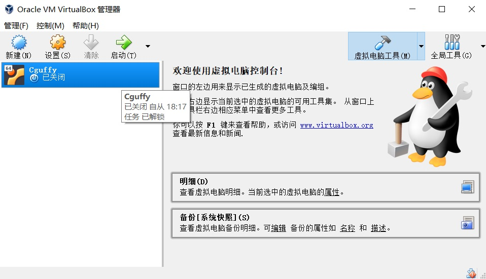

<center><font size="7" font face="楷体" font color="#00dddd">智能蛇实验报告</font></center><br>
<font size="4"><center>Cguffy 18342002</center></font><br>


<font size="5">1.智能蛇编程设计</font><br><br>
<font size="4">（1）学习导入时间</font>  
<br>
<font size="3">&nbsp;&nbsp;&nbsp;&nbsp;&nbsp;&nbsp;&nbsp;&nbsp;我们在之前的程序设计等课程中并未学习过如何使用 "<time.h>" 这个头文件，因此在得知智能蛇的任务要求之后非常的迷惑，不知道从何下手。于是，谷歌、百度上线了。。。。。。经过学习，终于知道了如何进行计时。</font><br>
```C
    #include <stdio.h>
    #include <time.h>

    //wait 为一个整型值参数记录需要等待的毫秒数
    void sleep(clock_t wait){
        clock_t goal;
        goal = wait + clock();
        while(goal > clock());
    }                         
```  

<font size="3">&nbsp;&nbsp;&nbsp;&nbsp;&nbsp;&nbsp;&nbsp;&nbsp;这个就是及时的代码。sleep(1000) 即及时一秒钟。</font>  

<font size="4">（2）根据提供的伪代码编写程序</font>  

<font size="3">&nbsp;&nbsp;&nbsp;&nbsp;&nbsp;&nbsp;&nbsp;&nbsp;在学会了往程序中导入计时器之后，任务紧接着就变成了如何实现智能蛇了。只不过由于有 introduction 里提供的伪代码，思路变得清晰了很多，相应地，任务完成也快了不少。</font><br>
```C
    #include <stdio.h>
#include <stdlib.h>
#include <time.h>

#define SNAKE_MAX_LENGTH 20          //蛇的最大长度 
#define SNAKE_HEAD 'H' 
#define SNAKE_BODY 'X'
#define	BLANK_CELL ' '
#define SNAKE_FOOD '$'
#define WALL_CELL '*'

//snake stepping:dy=-1(up),1(down); dx=-1(left),1(right); dx/dy = 0(no move); 
void snakeMove(int ,int );
//put a food randomized on a blank cell
void putMoney(void);
//out cells of the grid
void output();
//outs when gameover
void gameover(int ,int );
//determine whether the snake get the money or not
void getMoney(int ,int );
//wait for "wait"ms 
void sleep(clock_t wait);
//to decide where to go next
char whereGoNext(const int ,const int ,const int ,const int ); 
//to get the absolute value
int getAbsolute(const int ,const int );

char map[12][12]=
	{"************",
	 "*XXXXH     *",
	 "*          *",                 //初始状态 
	 "*          *",                 //直接打表 
	 "*          *",
	 "*          *",
	 "*  *****   *",
	 "*          *",
	 "*          *",
	 "*          *",
	 "*          *",
	 "************"};

//define vars for snake, notice name of vars in C	 
int snakeX[SNAKE_MAX_LENGTH]={1,2,3,4,5};
int snakeY[SNAKE_MAX_LENGTH]={1,1,1,1,1};               //蛇头和蛇身的坐标 
int snakeLength = 5;                                    //蛇的初始长度 

int isAlive = 1;                                        //等于 1 时表示蛇还存活，等于 0 时表示蛇已死亡 
int flag=0;                                             //等于 1 时表示吃到了 $ ,等于 0 时表示没吃到 $ 
int Hx=5,Hy=1;                                          //蛇头的坐标
int Fx,Fy;                                              //食物的坐标 

int main(){
	char ch;
	int i,j;
	
	putMoney();                                      //最开始放置一个食物 $ 
	
	for(i=0;i<12;i++){
		for(j=0;j<12;j++){
			if(j<11)
				printf("%c",map[i][j]);
			else if(j==11)
				printf("%c\n",map[i][j]);
		}
	}                                                //打印初识蛇的位置与地图 
	
	while(isAlive!=0){
		
		sleep(1000);
		ch=whereGoNext(Hx,Hy,Fx,Fy);
		switch(ch){
			case 'A': gameover(-1,0);                //先判断是否触发gameover的条件 
					  snakeMove(-1,0);               //往左移动一格 
					  output();break;                //打印 
			case 'D': gameover(1,0);
					  snakeMove(1,0);                //往右移动一格 
					  output();break;              
			case 'W': gameover(0,-1);
					  snakeMove(0,-1);               //往上移动一格 
					  output();break;
			case 'S': gameover(0,1);
					  snakeMove(0,1);                //往下移动一格 
					  output();break;
		}
		Hx=snakeX[snakeLength-1];
		Hy=snakeY[snakeLength-1]; 
		
	}
	
	printf("Game Over!!!\n");
	
	return 0;
} 

void snakeMove(int dx,int dy){
	int tmpX1=0,tmpY1=0,tmpX2=0,tmpY2=0,i,j;
	tmpX1=snakeX[snakeLength-1];
	tmpY1=snakeY[snakeLength-1];
	
	getMoney(dx,dy);
	if(flag==1){							  //当吃到了 $ 时 
		snakeLength++;
		snakeX[snakeLength-1]=snakeX[snakeLength-2]+dx;
		snakeY[snakeLength-1]=snakeY[snakeLength-2]+dy;
		map[snakeY[snakeLength-1]][snakeX[snakeLength-1]]='H';
		map[snakeY[snakeLength-2]][snakeX[snakeLength-2]]='X';
		flag=0;
	} 										  
	else if(flag==0){                         //当没吃到 $ 时 
		for(i=snakeLength-2;i>=0;i--){
			tmpX2=snakeX[i];
			tmpY2=snakeY[i];                  //tmpX2、tmpY2用于记录蛇当前部分的坐标 
			snakeX[i]=tmpX1;
			snakeY[i]=tmpY1;                  //tmpX1、tmpY1用于记录蛇上一部分的坐标 
			tmpX1=tmpX2;
			tmpY1=tmpY2;
		}                                     //将后面的蛇身往前挪一位 
	
		map[tmpY1][tmpX1]=' ';                //将末尾改为 空格 
	
		if(dx==-1&&dy==0)
			snakeX[snakeLength-1]-=1;
		else if(dx==1&&dy==0)
			snakeX[snakeLength-1]+=1;
		else if(dx==0&&dy==-1)
			snakeY[snakeLength-1]-=1;
		else if(dx==0&&dy==1)
			snakeY[snakeLength-1]+=1;		  //将蛇头按方向行进一位
			                                   
		for(i=0;i<snakeLength;i++){
			if(i<snakeLength-1)
				map[snakeY[i]][snakeX[i]]='X';
			else if(i==snakeLength-1)
				map[snakeY[i]][snakeX[i]]='H';
		}									  //将蛇头和蛇身赋值相应字符
	}
}

void gameover(int dx,int dy){
	if(map[snakeY[snakeLength-1]+dy][snakeX[snakeLength-1]+dx]=='X'||map[snakeY[snakeLength-1]+dy][snakeX[snakeLength-1]+dx]=='*')
		isAlive=0;
}                                             //判断游戏是否结束，若结束，将 0 赋值给 isAlive 

void putMoney(){
	int x,y;
	
	srand(time(NULL));
	x=1+(rand()%10);
	y=1+(rand()%10);
	while(map[x][y]!=' '){
		x=1+(rand()%10);
		y=1+(rand()%10);
	}
	Fx=y;
	Fy=x;
	map[x][y]='$';
}                                          //随机位置产生一个$

void getMoney(int dx,int dy){	
	if(map[snakeY[snakeLength-1]+dy][snakeX[snakeLength-1]+dx]=='$'){
		if(snakeLength<SNAKE_MAX_LENGTH){
			flag=1;
			putMoney();
		}
		else
			putMoney(); 
	}
}                                          //判断是否吃到 $ 

void output(){
	int i=0,j=0;
	for(i=0;i<12;i++){
		for(j=0;j<12;j++){
			if(j<11)
				printf("%c",map[i][j]);
			else if(j==11)
				printf("%c\n",map[i][j]);
		}
	}
}	                                    	  //打印 

void sleep(clock_t wait)
{
clock_t goal;
goal = wait + clock();
while(goal > clock());
}

int getAbsolute(const int x,const int y){
	if(x-y<0)
		return y-x;
	else
		return x-y;
}

char whereGoNext(const int Hx,const int Hy,const int Fx,const int Fy){
	char movable[4]={'A','D','W','S'};                       //可走的四个方向：A:左；D：右；W:上；S:下
	int distance[4]={0,0,0,0};                              //走各个方向与最终目标的距离
	
	if(map[Hy][Hx-1]==' '||map[Hy][Hx-1]=='$')
		distance[0]= getAbsolute(Fx,Hx-1) + getAbsolute(Fy,Hy);
	else
		distance[0]=9999;
	if(map[Hy][Hx+1]==' '||map[Hy][Hx+1]=='$')
		distance[1]= getAbsolute(Fx,Hx+1) + getAbsolute(Fy,Hy);
	else
		distance[1]=9999;
	if(map[Hy-1][Hx]==' '||map[Hy-1][Hx]=='$')
		distance[2]= getAbsolute(Fx,Hx) + getAbsolute(Fy,Hy-1);
	else
		distance[2]=9999;
	if(map[Hy+1][Hx]==' '||map[Hy+1][Hx]=='$')
		distance[3]= getAbsolute(Fx,Hx) + getAbsolute(Fy,Hy+1);
	else
		distance[3]=9999;                                   //计算走四个方向后与食物的距离 
	
	if(distance[0]==9999&&distance[1]==9999&&distance[2]==9999&&distance[3]==9999){
		isAlive=0;
		return movable[0];
	}                                                       //如果四个方向都是死路 则生命值变为 0 
	else{
		int min=9999,flag=0,i=0;
		for(i=0;i<4;i++){
			if(min>distance[i]){
				flag=i;
				min=distance[i];
			}
		}
		return movable[flag];
	}                                                        //返回最近的走法 
}
```  
<font size="3">&nbsp;&nbsp;&nbsp;&nbsp;&nbsp;&nbsp;&nbsp;&nbsp;这个就是智能蛇的代码。试了一下连续的五个障碍物放中间和四散分布n多个障碍物时，在 蛇比较短 的情况下并不会导致蛇自杀行为。但是，发现了这个算法还有挺多不智能的地方，例子如下。</font><br>
```C
    {"************",
     "*          *",
     "*          *",               
     "*          *",                 
     "*          *",
     "*     $    *",
     "*  *****   *",
     "*      H   *",
     "*      X   *",
     "*    XXX   *",
     "*          *",
     "************"}
```  
<font size="3">&nbsp;&nbsp;&nbsp;&nbsp;&nbsp;&nbsp;&nbsp;&nbsp;在如上这种情况时，根据算法，蛇会往左走：</font><br>
```C
    {"************",
     "*          *",
     "*          *",               
     "*          *",                 
     "*          *",
     "*     $    *",
     "*  *****   *",
     "*     HX   *",
     "*      X   *",
     "*     XX   *",
     "*          *",
     "************"}
```  
<font size="3">&nbsp;&nbsp;&nbsp;&nbsp;&nbsp;&nbsp;&nbsp;&nbsp;但在这时，就会发现往上走并不可以完成。此时智能继续往左走，直到上面不是墙壁为止。这导致最终实际上绕了一大段路。最佳的走法应该是往左走，然后往上走，再往左走。只不过我暂时没想到该怎么改进这个算法。。。</font><br><br>
<font size="5">2.虚拟机、Linux、ubuntu的尝试使用</font><br><br>
<font size="4">（1）虚拟机的下载、安装等</font><br>
<br>
<br>
<br><br>
<font size="4">（2）任务尝试</font><br>
<font size="3">&nbsp;&nbsp;&nbsp;&nbsp;&nbsp;&nbsp;&nbsp;&nbsp;由于有好心人提供的博客，下载安装导入系统等东西顺利地完成了。可是······任务并没有相应地博客，只能自己慢慢摸索，而这个结果······非常惨不忍睹。根据要求做了调整之后，结果蛇根本动不了......所以就不上图了。<br>免(zhen) 得(de) 强(shi) 到(fen) 吓(diu) 人(ren)</font>