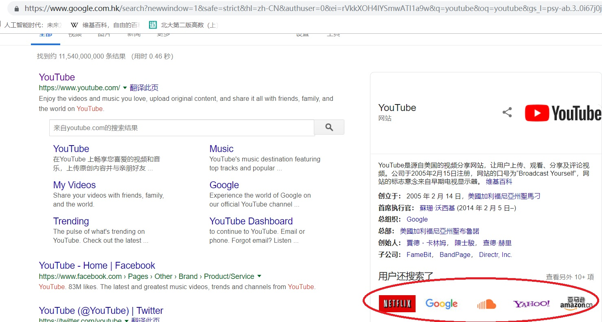

互联网时代的盈利模式
  
&nbsp;&nbsp;&nbsp;&nbsp;&nbsp;&nbsp;&nbsp;&nbsp;如今的时代，互联网飞速发展，相应地也产生了许多与互联网相关的盈利模式，而这其中，“流量” 一词是这些盈利模式成功的一大关键。 

  

一、“流量”的重要性  
&nbsp;&nbsp;&nbsp;&nbsp;&nbsp;&nbsp;&nbsp;&nbsp;我们这里说的 “流量” 并不是指我们平常手机上使用的 流量 ，而是客户，或者可以理解为 “人流量” 。 &nbsp;&nbsp;&nbsp;&nbsp;&nbsp;&nbsp;&nbsp;&nbsp;举个例子.用户每天玩手机的时间是有限的。用微信时间长了，自然用陌陌时间就短了。在家玩游戏时间长了，逛街的人就少了。竞品维度上：用360安全卫士，你就不需要腾讯安全管家。用滴滴就不用uber。 &nbsp;&nbsp;&nbsp;&nbsp;&nbsp;&nbsp;&nbsp;&nbsp;因此，如果想要创业成功，或者顺利展开某一个网络项目，首先需要的就是能够占有足够的 “流量” 。否则，即便你做的产品再好，没人使用，一切也都是一场空。 
  

二、与“流量”相关的盈利模式  
“流量-广告”模式 
&nbsp;&nbsp;&nbsp;&nbsp;&nbsp;&nbsp;&nbsp;&nbsp;有人曾经嘲笑谷歌，认为“谷歌就是个卖广告的”。这句话道出了互联网最基本的盈利模式——“流量-广告”模式。“流量-广告”模式有两种个形态： &nbsp;&nbsp;&nbsp;&nbsp;&nbsp;&nbsp;&nbsp;&nbsp;①“内容-流量”形态，也就是通过精彩的内容，吸引流量，以此作为做广告的基础； &nbsp;&nbsp;&nbsp;&nbsp;&nbsp;&nbsp;&nbsp;&nbsp;②“搜索引擎”形态，代表企业就是百度和谷歌。 &nbsp;&nbsp;&nbsp;&nbsp;&nbsp;&nbsp;&nbsp;&nbsp;早期的互联网企业，其盈利基本都来自于“流量-广告”模式。这个模式是从盈利的角度说，是典型的“交叉补贴”。使用者在使用服务的时候，如果点击了广告，则投放广告的企业负责付款。 &nbsp;&nbsp;&nbsp;&nbsp;&nbsp;&nbsp;&nbsp;&nbsp;目前这种模式是使用最广泛的模式之一，因为他的起步相对容易，有一个好的主题外加一个网站，谁都可以进入这个模式。 &nbsp;&nbsp;&nbsp;&nbsp;&nbsp;&nbsp;&nbsp;&nbsp;但这个模式最大的不足，是他的消费对象并不是普通老百姓，而是企业。这限制了互联网的商业价值。直到电商模式的出现. 
  

&nbsp;&nbsp;&nbsp;&nbsp;&nbsp;&nbsp;&nbsp;&nbsp;其实互联网的盈利模式还有很多，只是基本都不是以“流量”作为核心的模式，只不过基本都是默认有足够 “流量” 的模式。 
