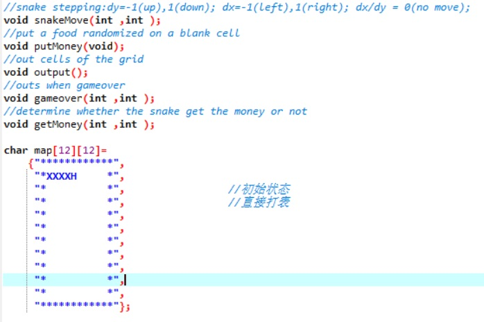
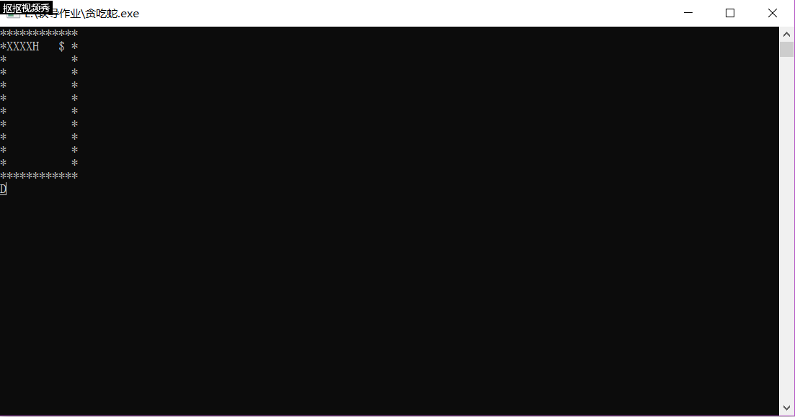

<center><font size="7" font face="楷体" font color="#00dddd">贪吃蛇设计及算法</font></center><br>
<font size="4"><center>Cguffy 18342002</center></font><br>

<font size="5">1.贪吃蛇设计</font><br><br>
<font size="4">（1）自顶向下，逐步求精的设计思想</font><br>
<font size="3">&nbsp;&nbsp;&nbsp;&nbsp;&nbsp;&nbsp;&nbsp;&nbsp;依据之前所学习的程序设计思想： “自顶向下，逐步求精”，我将贪吃蛇分成了几大块任务，分别对应着不同的函数：<br>①整体实现：main()函数；<br>②蛇的移动：snakeMove()函数；<br>③放置食物：putFood()函数；<br>④吃到食物增长：getFood()函数；<br>⑤打印地图、蛇以及食物：output()函数；<br>⑥游戏结束：gameover()函数；<br>⑦设计地图：map[12][12].</font><br>
<br><br>

<font size="4">（2）各个函数的实现</font><br>
<font size="3">&nbsp;&nbsp;&nbsp;&nbsp;&nbsp;&nbsp;&nbsp;&nbsp;在将任务细分之后，需要做的就是将各个任务用伪代码进行实现。<br>（此处只展示main()函数的伪代码）</font><br>
```
	print the map
	WHILE lifeValue != 0 THEN
		direction = input
		snakeMove(direction)
		output()
		IF  is gameover THEN
			lifeValue = 0
		END IF
	END WHILE
	print "Game Over!!!"
```  
<br>
<font size="5">2.贪吃蛇实现</font><br><br>
<font size="4">（1）分部实现</font><br>
<font size="3">&nbsp;&nbsp;&nbsp;&nbsp;&nbsp;&nbsp;&nbsp;&nbsp;既然伪代码都写好了，就要开始用C语言进行落实实现了。首先是将各个函数进行实现。</font><br>

```C
	void snakeMove(int dx,int dy){
	int tmpX1=0,tmpY1=0,tmpX2=0,tmpY2=0,i,j;
	tmpX1=snakeX[snakeLength-1];
	tmpY1=snakeY[snakeLength-1];
	
	getMoney(dx,dy);
	if(flag==1){							  //当吃到了 $ 时 
		snakeLength++;
		snakeX[snakeLength-1]=snakeX[snakeLength-2]+dx;
		snakeY[snakeLength-1]=snakeY[snakeLength-2]+dy;
		map[snakeY[snakeLength-1]][snakeX[snakeLength-1]]='H';
		map[snakeY[snakeLength-2]][snakeX[snakeLength-2]]='X';
		flag=0;
	} 										  
	else if(flag==0){                         //当没吃到 $ 时 
		for(i=snakeLength-2;i>=0;i--){
			tmpX2=snakeX[i];
			tmpY2=snakeY[i];                  //tmpX2、tmpY2用于记录蛇当前部分的坐标 
			snakeX[i]=tmpX1;
			snakeY[i]=tmpY1;                  //tmpX1、tmpY1用于记录蛇上一部分的坐标 
			tmpX1=tmpX2;
			tmpY1=tmpY2;
		}                                     //将后面的蛇身往前挪一位 
	
		map[tmpY1][tmpX1]=' ';                //将末尾改为 空格 
	
		if(dx==-1&&dy==0)
			snakeX[snakeLength-1]-=1;
		else if(dx==1&&dy==0)
			snakeX[snakeLength-1]+=1;
		else if(dx==0&&dy==-1)
			snakeY[snakeLength-1]-=1;
		else if(dx==0&&dy==1)
			snakeY[snakeLength-1]+=1;		  //将蛇头按方向行进一位
			                                   
		for(i=0;i<snakeLength;i++){
			if(i<snakeLength-1)
				map[snakeY[i]][snakeX[i]]='X';
			else if(i==snakeLength-1)
				map[snakeY[i]][snakeX[i]]='H';
		}									  //将蛇头和蛇身赋值相应字符
	}
}
``` 
<font size="3">snakeMove()实现</font><br><br>
```C
	void gameover(int dx,int dy){
	if(map[snakeY[snakeLength-1]+dy][snakeX[snakeLength-1]+dx]=='X'||map[snakeY[snakeLength-1]+dy][snakeX[snakeLength-1]+dx]=='*')
		isAlive=0;
	} 
```
<font size="3">gameover()实现</font><br><br>
```C
	void putFood(){
	int x,y;
	
	srand(time(NULL));
	x=1+(rand()%10);
	y=1+(rand()%10);
	while(map[x][y]!=' '){
		x=1+(rand()%10);
		y=1+(rand()%10);
	}
	map[x][y]='$';
}
```
<font size="3">putFood()实现</font><br><br>
```C
	void getFood(int dx,int dy){	
	if(map[snakeY[snakeLength-1]+dy][snakeX[snakeLength-1]+dx]=='$'){
		if(snakeLength<SNAKE_MAX_LENGTH){
			flag=1;
			putFood();
		}
		else
			putFood(); 
	}
}
```
<font size="3">getFood()实现</font><br><br>
```C
void output(){
	int i=0,j=0;
	for(i=0;i<12;i++){
		for(j=0;j<12;j++){
			if(j<11)
				printf("%c",map[i][j]);
			else if(j==11)
				printf("%c\n",map[i][j]);
		}
	}
}
```
<font size="3">output()实现</font><br><br>
<font size="4">（2）整合调整</font><br>
<font size="3">&nbsp;&nbsp;&nbsp;&nbsp;&nbsp;&nbsp;&nbsp;&nbsp;并不是每个函数实现完就能立刻解决问题的，还需要将各个函数整合在一起并进行相应的调整。在调整完之后，编译运行，你会发现，游戏完成啦！！</font><br>
<br>
